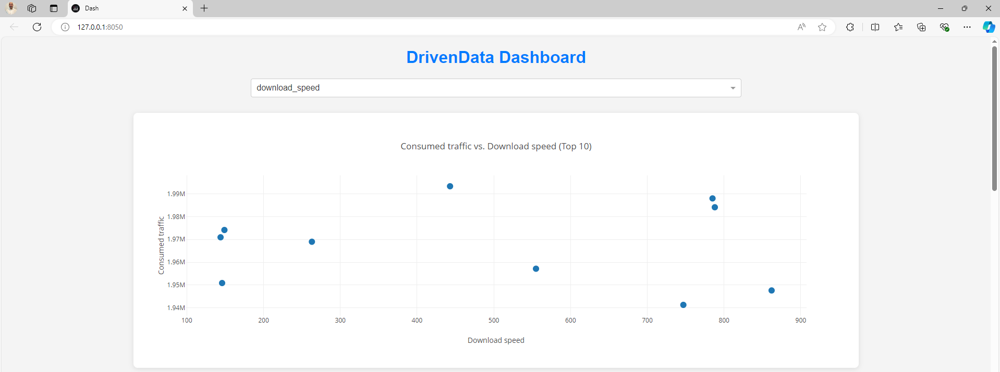
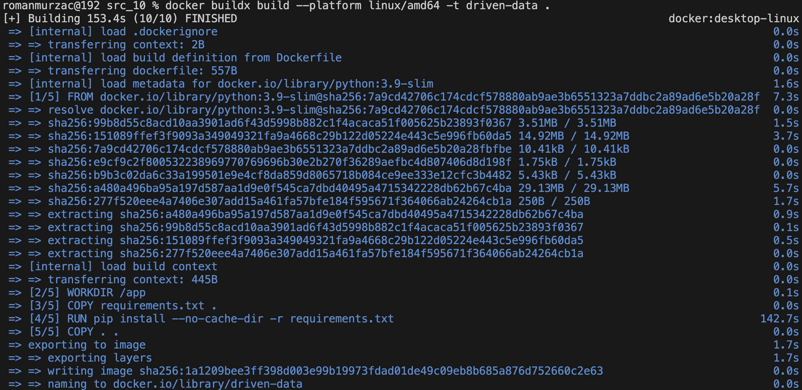
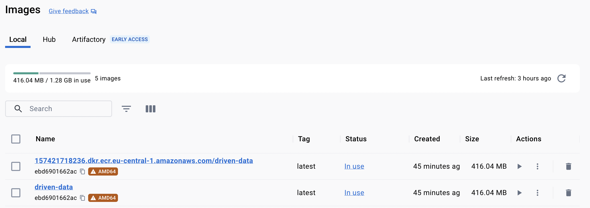
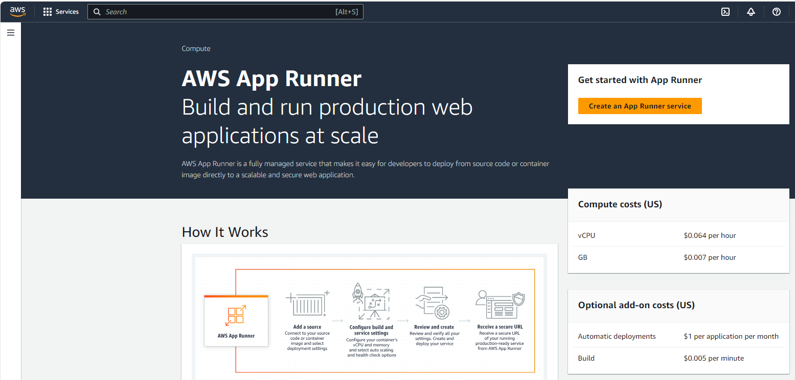
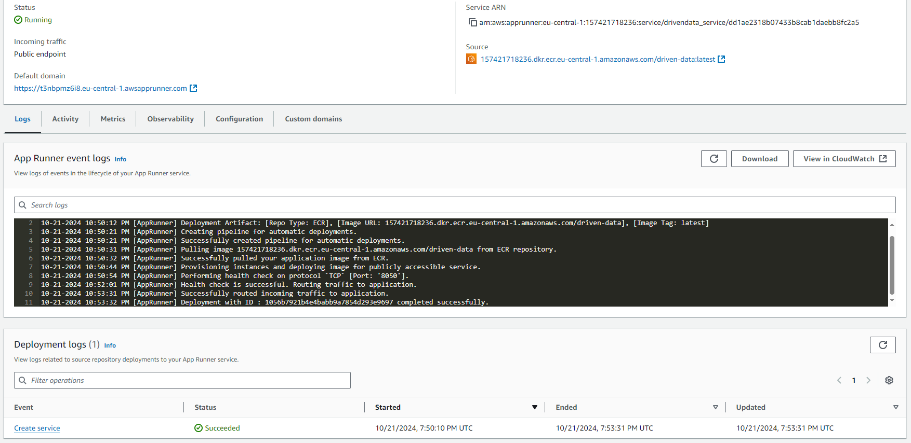

# **Chapter 10:** Analytics and Vizualization

**NOTE:** This chapter involves working with cloud services that are charged by the cloud provider. Consult the [AWS Pricing Calculator](https://calculator.aws/#/) for a forecast of the estimated cost of the services used in this chapter. If you proceed with this chapter, you do so at your own responsibility, and the author has no responsibility for the resulting bill.

## Scenario
For the tenth chapter/sprint, it is required to connect to the streaming data and create a dashboard for the *DrivenData* company. The dashboard should display in real-time the following metrics: the relationship between consumed traffic and a selected field, the person name with the highest value in the selected field, the selected field compared to all data indices, the distribution of the selected field, a histogram of the selected field, and the percentage of users in each age group.

## Assignment
For this Sprint / Chapter your tasks include:
1. **Read** the following topics in the [Theory](#theory) section:\
    a. Dashboard.\
    b. Dash.\
    c. Elastic Container Registry.\
    d. Cloud App Runner.

2. **Implement** the steps in the [Practice](#practice) section for *DataDriven* company:\
    a. Create Local Dashbord:
    * i. Create dashboard.
    * ii. Add style to dashboard.
    * iii. Test dashboard.

    b. Create Docker Dashboard:
    * i. Define dependecies.
    * ii. Create Dockerfile.
    * iii. Create Docker image.
    * iv. Run Docker container.

    c. Create Cloud Dashboard:
    * i. Update Docker image.
    * ii. Create ECR repository.
    * iii. Create App Runner.
    * iv. Deploy dashboard.
    * v. Test dashboard.

3. **Complete** tasks for *LeadData*:
    * Review the *Scenario* section, complete the stages in the *Assignment*, and document your work in `work_10/scenario_10.md`. Store all evidence of your work in the `work_10` directory.

## Theory
The main theoretical notions for the chapter along with resources for self-paced learning.

### Dashboard
#### Description
A dashboard is a way of displaying various types of visual data in one place. Usually, a dashboard is intended to convey different, but related information in an easy-to-digest form. And oftentimes, this includes things like key performance indicators or other important business metrics that stakeholders need to see and understand at a glance.
#### References
[Databox - What is a Data Dashboard? Definition, Benefits, and Examples](https://databox.com/data-dashboard)\
[Tableau - What is a dashboard? A complete overview](https://www.tableau.com/dashboard/what-is-dashboard)\
[Amplitude - How to Build the Perfect Analytics Dashboard](https://amplitude.com/blog/analytics-dashboard)

### Dash
#### Description
Dash is a popular and trusted Python framework for building interactive web apps with Plotly.js, React and Flask. Learn how to create, style, deploy and scale your Dash apps with tutorials, examples and documentation.
#### References
[Plotly - Dash in 20 Minutes](https://dash.plotly.com/tutorial)\
[Real Python - Develop Data Visualization Interfaces in Python With Dash](https://realpython.com/python-dash/)\
[GitHub - Dash](https://github.com/plotly/dash)

### Elastic Container Registry
#### Description
Amazon Elastic Container Registry (Amazon ECR) is an AWS managed container image registry service that is secure, scalable, and reliable. Amazon ECR supports private repositories with resource-based permissions using AWS IAM. This is so that specified users or Amazon EC2 instances can access your container repositories and images. You can use your preferred CLI to push, pull, and manage Docker images, Open Container Initiative (OCI) images, and OCI compatible artifacts.
#### References
[AWS - What is Amazon Elastic Container Registry?](https://docs.aws.amazon.com/AmazonECR/latest/userguide/what-is-ecr.html)\
[AWS - Amazon Elastic Container Registry Documentation](https://docs.aws.amazon.com/ecr/)

### Cloud App Runner
#### Description
AWS App Runner is an AWS service that provides a fast, simple, and cost-effective way to deploy from source code or a container image directly to a scalable and secure web application in the AWS Cloud. You don't need to learn new technologies, decide which compute service to use, or know how to provision and configure AWS resources. App Runner connects directly to your code or image repository. It provides an automatic integration and delivery pipeline with fully managed operations, high performance, scalability, and security.
#### References
[AWS - What is AWS App Runner?](https://docs.aws.amazon.com/apprunner/latest/dg/what-is-apprunner.html)\
[AWS - AWS App Runner Documentation](https://docs.aws.amazon.com/apprunner/)

## Practice
Implemention for the practical part of the chapter.

### Create Local Dashbord
As the data are ingested both, in batch and streaming and all processes are in place, from streaming data can be created a dashboard for technical and business needs. For this purpose will be created a dashboard that allow users to view in real time five different vizualizations based on selected parameters.

#### Create dashboard
In directory `src_10` create a file `dashboard.py` and paste the code from below. This part of code will import all necessary modules, will define connection to the *drivendata_db* database and will retrieve all data from database. Also, will define the columns that are available for user menu to be displayed in dashboard.
```
import dash
import pandas as pd
import plotly.express as px

from dash import dcc, html
from dash.dependencies import Input, Output
from sqlalchemy import create_engine

db_config = {
    'dbname': 'drivendata_db',
    'user': 'postgres',
    'password': 'password',
    'host': 'localhost',
    'port': '5432'
}

connection_str = f"postgresql://{db_config['user']}:{db_config['password']}@{db_config['host']}:{db_config['port']}/{db_config['dbname']}"

engine = create_engine(connection_str)
query = "SELECT * FROM streaming_layer.streaming_data;"
df = pd.read_sql(query, engine)

allowed_columns = ["accessed_at","session_duration","download_speed","upload_speed","consumed_traffic"]
```

Initialize the dashboard and create a division. In the division create a header with the name of the dashboard *DrivenData Dashboard*. Create a *dropdown* menu to select from allowed columns defined above. Also, define six graphs: scatter, bar, line, box, histogram, and pie chart.
```
app = dash.Dash(__name__)

app.layout = html.Div([
    html.H1("DrivenData Dashboard"),

    dcc.Dropdown(
        id='column-dropdown',
        options=[{'label': col, 'value': col} for col in allowed_columns],
        value='upload_speed',
        clearable=False,
        className='dropdown'
    ),

    html.Div(className='graph-container', children=[
        dcc.Graph(id='scatter-plot', className='graph'),
        dcc.Graph(id='name-parameter-plot', className='graph'),
        dcc.Graph(id='line-plot', className='graph'),
        dcc.Graph(id='box-plot', className='graph'),
        dcc.Graph(id='histogram', className='graph'),
        dcc.Graph(id='pie-chart', className='graph')
    ])
])
```

Create functions with callback. The function will process the data to be used with each specific graph and the callback will ensure that the graph is updated based on the data. Once the whole code is in the file, save the file and run it. It will display in terminal the local link for the dashboard.
```
@app.callback(
    Output('scatter-plot', 'figure'),
    Input('column-dropdown', 'value')
)
def update_scatter_graph(selected_column):
    df_sorted = df.sort_values(by='consumed_traffic', ascending=False).head(10)
    fig = {
        'data': [
            {
                'x': df_sorted[selected_column],
                'y': df_sorted['consumed_traffic'],
                'type': 'scatter',
                'mode': 'markers',
                'marker': {'size': 12}
            }
        ],
        'layout': {
            'title': f'Consumed traffic vs. {" ".join(selected_column.split("_")).capitalize()} (Top 10)',
            'xaxis': {'title': " ".join(selected_column.split("_")).capitalize()},
            'yaxis': {'title': 'Consumed traffic'}
        }
    }
    return fig

@app.callback(
    Output('name-parameter-plot', 'figure'),
    Input('column-dropdown', 'value')
)
def update_names_graph(selected_parameter):
    df_sorted = df.sort_values(by=selected_parameter, ascending=False).head(10)
    fig = {
        'data': [
            {
                'x': df_sorted['person_name'],
                'y': df_sorted[selected_parameter],
                'type': 'bar'
            }
        ],
        'layout': {
            'title': f'Top 10 People by {" ".join(selected_parameter.split("_")).capitalize()}',
            'xaxis': {'title': 'Person name'},
            'yaxis': {'title': " ".join(selected_parameter.split("_")).capitalize()}
        }
    }
    return fig

@app.callback(
    Output('line-plot', 'figure'),
    Input('column-dropdown', 'value')
)
def update_line_graph(selected_parameter):
    fig = px.line(df, x=df.index, y=selected_parameter, title=f'{" ".join(selected_parameter.split("_")).capitalize()} over Index')
    fig.update_layout(yaxis_title=" ".join(selected_parameter.split("_")).capitalize())
    return fig

@app.callback(
    Output('box-plot', 'figure'),
    Input('column-dropdown', 'value')
)
def update_box_graph(selected_parameter):
    fig = px.box(df, y=selected_parameter, title=f'Distribution of {" ".join(selected_parameter.split("_")).capitalize()}')
    fig.update_layout(yaxis_title=" ".join(selected_parameter.split("_")).capitalize())
    return fig

@app.callback(
    Output('histogram', 'figure'),
    Input('column-dropdown', 'value')
)
def update_histogram(selected_parameter):
    fig = px.histogram(df, x=selected_parameter, title=f'Histogram of {" ".join(selected_parameter.split("_")).capitalize()}', nbins=30)
    fig.update_layout(xaxis_title=" ".join(selected_parameter.split("_")).capitalize(), yaxis_title='Count')
    return fig

@app.callback(
    Output('pie-chart', 'figure'),
    Input('column-dropdown', 'value')
)
def update_pie_chart(selected_parameter):
    df['birth_year'] = pd.to_datetime(df['birth_date'], errors='coerce').dt.year
    year_percentages = (
        df['birth_year']
        .value_counts()
        .nlargest(10)
        .div(df['birth_year'].notna().sum())
        * 100
    )
    fig = px.pie(names=year_percentages.index, values=year_percentages.values, title='Distribution of Age')
    return fig

if __name__ == '__main__':
    app.run_server(debug=True)
```


Access the link that is displayed in terminal or introduce in browser the link [http://127.0.0.1:8050/](http://127.0.0.1:8050/) and the dashboard will be opened in the browser. Now it can be seen all six graphs, can be selected the field that should be displayed as second scale.\


#### Add style to dashboard
The dashboard is created and running localy, but stil it needs some style.\
Create a directory `assets` and inside of the directory create a file named `styles.css` and paste the content from below. Now the dashboard looks as in image below.
```
body {
    font-family: Arial, sans-serif;
    background-color: #f4f4f4;
    color: #333;
}
h1 {
    text-align: center;
    color: #007bff;
}
.dropdown {
    margin: 20px auto;
    width: 50%;
}
.graph-container {
    display: flex;
    justify-content: space-around;
    flex-wrap: wrap;
    margin: 20px auto;
    width: 75%;
}
.graph {
    flex: 1 1 45%;
    margin: 10px;
    background: white;
    border-radius: 8px;
    box-shadow: 0 2px 10px rgba(0, 0, 0, 0.1);
    padding: 20px;
}
.bar-plot {
    color: #28a745;
}
.line-plot {
    color: #17a2b8;
}
.box-plot {
    color: #ffc107;
}
.histogram {
    color: #dc3545;
}
.pie-chart {
    color: #6f42c1;
}
```


#### Test dashboard
As the dashboard is running locally it can be tested.\
First graph is a *scatter* plot and it represent first 10 *Consummed traffic* on *Y axis* and selected field on *X axis*.\


Second graph is a *bar* plot and it represent first 10 *People name* on *X axis* and selected field on *Y axis*.\


Third graph is a *line* plot and it represent selected field on *Y axis* and *index* on *X axis*.\


Fourth graph is a *box* plot and it represent the distribution of the selected field values.\


Fifth graph is a *histogram* and it represent number of occurences on *Y axis* and selected field on *X axis*.\


Sixth graph is a *pie chart* and it represent the distribution of first 10 year of birth of the users in percentage.\


### Create Docker Dashboard
Once the dashboard is fully functional on local machine, it is needed to containerize it and run in container.

#### Define dependecies
In order to have all the dependecies installed in the container environment, create a file `requirements.txt` and copy the content from below.
```
boto==2.49.0
dash==2.18.1
dash-core-components==2.0.0
dash-html-components==2.0.0
pandas==2.2.3
```

#### Create Dockerfile
In order to containerize the dashboard should be created a `Dockerfile` and copy the content from below. This *Dockerfile* will pull the Python image and will use it as a template, inside the container will be setup as a working directory the *app* directory. In working directory will be copied the *requirements.txt* file and all dependencies will be installed in the container. Also, will be copied all files from the local directory into the container working directory. The port *8050* will be exposed for traffic. Will be executed command `python app.py` that run the dashboard.
```
FROM python:3.9-slim
WORKDIR /app
COPY requirements.txt .
RUN pip install --no-cache-dir -r requirements.txt
COPY . .
EXPOSE 8050
CMD ["python", "app.py"]
```

#### Create Docker image
Once the *Dockerfile* is ready in terminal run the command from below that will create a image named *driven-data* for *AMD64* Architecture.
```
docker buildx build --platform linux/amd64 -t driven-data .
```


#### Run Docker container
After the *driven-data* image was created run in terminal the command from below. It will display in terminal the same message as for local running and from this message access the dashboard that now is running in container. Also, the dashboard can be accessed from *Docker Desktop* by accessing the container exposed port on the container page.
```
docker run -p 8080:8080 driven-data
```

### Create Cloud Dashboard
After the dashboard was developed locally, was deployed in container and it was confirmed by stakeholders, it can be productionized using Cloud.

#### Update Docker image
In order to publish to the cloud, the dashboard needs to be updated, as well the docker image in order to take the updates of the dashboard.\
Create a file named `app.py` and paste the whole content from *dashboard.py* file. Replace database connection section with the content from below. This will connect to *Athena* database and will retrieve data in real time.
```
import boto3

client = boto3.client('athena')
df = client.start_query_execution(
    QueryString="SELECT * FROM streaming_layer.streaming_data",
    QueryExecutionContext={'Database': 'driven_data'},
    ResultConfiguration={'OutputLocation': 's3://drivendata-results/'}
)
```

Also, update the script execution section by pasting the code from below.
```
if __name__ == '__main__':
    app.run_server(debug=False, host='0.0.0.0', port=8050)
```

Now run one more time the command for image building.
```
docker buildx build --platform linux/amd64 -t driven-data .
```

#### Create ECR repository
Install [AWS CLI](https://docs.aws.amazon.com/cli/latest/userguide/getting-started-install.html#getting-started-install-instructions) and run in termin command from below. After this, it will ask to introduce the *Key ID*, *Key Secret*, *Region*. Once all these operations are done, AWS operations are possible from local terminal.
```
aws configure
```

Navigate to AWS Console and access *Elastic Container Registry* service. Press `Create repository`, introduce the name `driven-data` and press `Create`.\


Access created *driven-data* repository and press `View push commands`. The will appear a dialog window with four steps. Copy one by one the command and run them in local terminal.\


After run first command it should display a success message as in image below.\


Image build command can be skipped as the image is generated on local Docker Desktop. Run tagging command and push the image to the AWS Cloud Repository.\


Now in *Docker Desktop* on *Image* section can be seen both images, local one and image that is in AWS Cloud Repository. Can be observed that both images has the flag for *AMD64* Architecture.\


Navigate to the *Elastic Cloud Registry* service and access *driven-data* repository and now can be seen the image with the tag *latest* as it was tagged in terminal.\


#### Create App Runner
Access *AWS App Runner* service and press `Create an App Runner service`. Choose `Container registry` for *Reposioty type* and `Amazon ECR` as a *Provider*. Browser for the image and select the *driven-data* repository and *latest* tag. Choose `Automatic` for *Deployment trigger* and `Create new service role` for *ECR access role*.\


#### Deploy dashboard
Once the *App Runner* is setup it will start deployment process that can be monitored inside the process at *Logs* section. It will display a message with *Successfully deployed*.\


The service *drivendata_service* now is available for use. The link for the dashoboard can be shared with stakeholders.\


#### Test dashboard
Navigate to the dashoboard by accessing the link in the *drivendata_service* and investigate all functionalities. Also, observe how graphs are updated in real time as the data are ingested in real time.\
