# **Chapter 3:** Batch processing - *Local Pipeline*

## Scenario
For third Chapter / Sprint needs to create orchestrated pipeline that will allow to run all stages in managed way. The pipeline should run daily and make data available at 08:00 AM. The pipeline should extract data into bronze layer (raw zone) named *driven_raw*, apply necessary transformations into silver layer (staging zone) named *driven_staging*, and upload data to the golden layer (trusted zone) named *driven_trusted* for consumtion in analytical process. It required in golden layer to have four tables: financial table for payment calculation, technical table for technical issue analyze, non-pii table for access for all users with limited access level across the organization, and pii table for users with high access level.

## Assignment
For current Sprint / Chapter your tasks are:
1. **Read** from [Theory](#theory) section about:\
    a. Docker:
    * i. Docker.
    * ii. Docker compose.
    * iii. Docker Desktop.
    * iv. Docker Hub.

    b. Airflow:
    * i. Airflow.
    * ii. Airflow DAG.
    * iii. Airflow operators.

    c. dbt.

2. **Implement** from [Practice](#practice) section for *DataDriven* company:\.\
    a. Setup Docker container:
    * i. Run Docker Desktop.
    * ii. Retrieve Docker Compose file.
    * iii. Update Docker Compose file.
    * iv. Add requirements.
    * v. Create Dockerfile.

    b. Create dbt:
    * i. Create project.
    * ii. Create profiles.
    * iii. Create sources.
    * iv. Create models.

    c. Create Airflow:
    * i. Run containers.
    * ii. Login.
    * iii. Setup Connection.
    * iv. Create DAG.
    * v. Run DAG.

    d. Setup pgAdmin 4 database:
    * i. Connect to database.
    * ii. Check data in pipeline.

3. **Work** for *LeadData* company on Sprint / Chapter tasks:\
**Note:** For point 3 (*Work*) implementation, read current part for individual scenario from `work_3/scenario_3.md` file and put all your work evidences in `work_3` directory.

## Theory
Main theoretical notions of the chapter with proper resources for self paced learning.

### Docker
#### Description
Docker is a software platform that allows you to build, test, and deploy applications quickly. Docker packages software into standardized units called containers that have everything the software needs to run including libraries, system tools, code, and runtime. Using Docker, you can quickly deploy and scale applications into any environment and know your code will run.
#### References
[Docker Curriculum - A Docker Tutorial for Beginners](https://docker-curriculum.com/)\
[IBM - What is Docker?](https://www.ibm.com/topics/docker)\
[AWS - What is Docker?](https://aws.amazon.com/docker/)

### Docker compose
#### Description
Docker Compose is a tool for running multi-container applications on Docker defined using the Compose file format. A Compose file is used to define how one or more containers that make up your application are configured. Once you have a Compose file, you can create and start your application with a single command: docker compose up.
#### References
[GitHub - Docker compose](https://github.com/docker/compose)\
[Docker docs - Docker Compose overview](https://docs.docker.com/compose/)\
[TutorialsPoint - Docker - Compose](https://www.tutorialspoint.com/docker/docker_compose.htm)

### Docker Desktop
#### Description
Docker Desktop is a one-click-install application for your Mac, Linux, or Windows environment that lets you build, share, and run containerized applications and microservices.
It provides a straightforward GUI (Graphical User Interface) that lets you manage your containers, applications, and images directly from your machine.
Docker Desktop reduces the time spent on complex setups so you can focus on writing code. It takes care of port mappings, file system concerns, and other default settings, and is regularly updated with bug fixes and security updates.
#### References
[Docker docs - Install Docker Desktop](https://docs.docker.com/desktop/install/windows-install/)\
[Docker docs - Overview of Docker Desktop](https://docs.docker.com/desktop/)

### Docker Hub
#### Description
Docker Hub is a container registry built for developers and open source contributors to find, use, and share their container images. With Hub, developers can host public repos that can be used for free, or private repos for teams and enterprises.
#### References
[Docker Hub](https://hub.docker.com/)\
[Docker docs - Overview of Docker Hub](https://docs.docker.com/docker-hub/)

### Airflow
#### Description
Apache Airflow (or simply Airflow) is a platform to programmatically author, schedule, and monitor workflows.
When workflows are defined as code, they become more maintainable, versionable, testable, and collaborative.
Use Airflow to author workflows as directed acyclic graphs (DAGs) of tasks. The Airflow scheduler executes your tasks on an array of workers while following the specified dependencies. Rich command line utilities make performing complex surgeries on DAGs a snap. The rich user interface makes it easy to visualize pipelines running in production, monitor progress, and troubleshoot issues when needed.
#### References
[GitHub - Apache Airflow](https://github.com/apache/airflow)\
[Run AI - Apache Airflow
Use Cases, Architecture, and Best Practices](https://www.run.ai/guides/machine-learning-operations/apache-airflow#:~:text=Apache%20Airflow%20is%20an%20open,be%20easily%20scheduled%20and%20monitored.)\
[Apache Airflow](https://airflow.apache.org/)

### Airflow DAG
#### Description
In Airflow, a DAG – or a Directed Acyclic Graph – is a collection of all the tasks you want to run, organized in a way that reflects their relationships and dependencies. A DAG is defined in a Python script, which represents the DAGs structure (tasks and their dependencies) as code.
#### References
[Apache Airflow - DAGs](https://airflow.apache.org/docs/apache-airflow/stable/core-concepts/dags.html)\
[Medium - Creating a DAG in Apache Airflow for Beginners: A Comprehensive Guide](https://medium.com/apache-airflow/creating-a-dag-in-apache-airflow-for-beginners-a-comprehensive-guide-30a61cf61bea)\
[Medium - Avoiding the pitfalls of top-level DAG code](https://medium.com/apache-airflow/avoiding-the-pitfalls-of-top-level-dag-code-fa480d9e75c6)

### Airflow operators
#### Description
Operators are the building blocks of Airflow DAGs. They contain the logic of how data is processed in a pipeline. Each task in a DAG is defined by instantiating an operator.
There are many different types of operators available in Airflow. Some operators such as Python functions execute general code provided by the user, while other operators perform very specific actions such as transferring data from one system to another.
#### References
[Apache Airflow - Operators](https://airflow.apache.org/docs/apache-airflow/stable/core-concepts/operators.html)\
[Astronomer - Airflow operators](https://www.astronomer.io/docs/learn/what-is-an-operator)

### dbt
#### Description
dbt (data build tool) makes data engineering activities accessible to people with data analyst skills to transform the data in the warehouse using simple select statements, effectively creating your entire transformation process with code.
#### References
[dbt](https://www.getdbt.com/)\
[Analytics8 - dbt (Data Build Tool) Overview: What is dbt and What Can It Do for My Data Pipeline?](https://www.analytics8.com/blog/dbt-overview-what-is-dbt-and-what-can-it-do-for-my-data-pipeline/#:~:text=dbt%20(data%20build%20tool)%20makes,entire%20transformation%20process%20with%20code.)\
[Medium - The Power of Data Build Tool (dbt)](https://medium.com/@nydas/the-power-of-data-build-tool-dbt-6b26dfab5bac)

## Practice
Implemention for the practical part of the chapter.

### Setup Docker container
The ETL was developed on local machine named *testing environment* in our case. After local prototying of the ETL process is done, validate with the stakeholders that the actual results match expected results.
In this chapter the *testing environment* processes will be transfered to the *development environment*, also local development that use tools for automation, orchestration and management of all processes as a single unit - **pipeline**.

First, ensure that you have all necessary tools from Chapter 1 installed on your local machine.

#### Run Docker Desktop
Run Docker Desktop application.
In Docker Desktop, beside many other options, you should be able to see: Containers, Images, and Volumes options.
All of them at this moment should be empty as there was nothing run yet.


As here are needed multiple container to hold the whole infrastructure, install [Docker Compose](https://docs.docker.com/compose/install/).\
Open a terminal and navigate to the project directory by changing `<your_path>` with your actual location and open it in VS Code.
```
cd C:\<your_path>\DrivenPath\chapter_3\src_3
code .
```

#### Retrieve Docker Compose file
Retrieve the `docker-compose.yml` file or [copy](https://airflow.apache.org/docs/apache-airflow/2.10.2/docker-compose.yaml) it in a file with the same name.
```
curl -LfO 'https://airflow.apache.org/docs/apache-airflow/2.10.2/docker-compose.yaml'
```
Now you can run the basic Apache Airflow on your local machine.

#### Update Docker Compose file
For current work there is needed to update the `docker-compose.yml` file and create custom image using as a template updated `docker-compose.yml` file.

Existing image is commented (line 52) as the default image will not be used. Custom image will be built (line 53).
To obtain an empty Airflow environment, change `AIRFLOW__CORE__LOAD_EXAMPLES` to `false` (line 62).
Also, need to add `dbt` directory for dbt project (line 80) and `data` directory (line 81) for generated data inside the container.
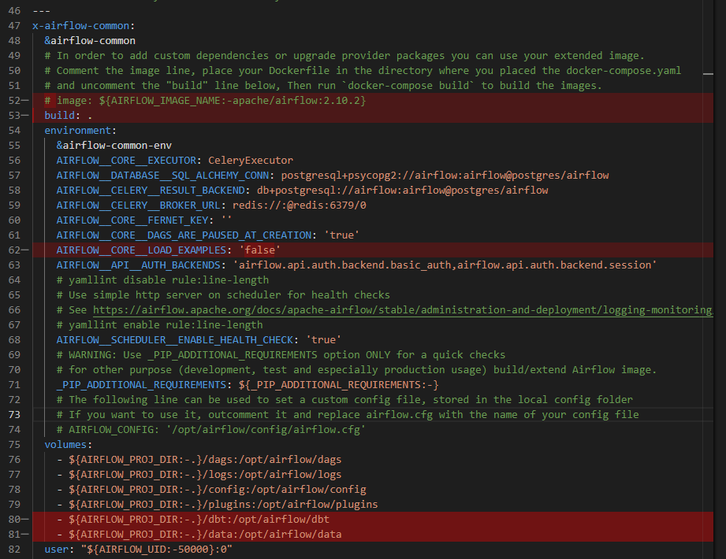

It can be created another database, different from database used by Airflow, but it will be use the same database, but the different schemas will be created.
Add port `5433:5432` to expose the database (lines 97-98). Also, need to make `data` directory available in database (line 101).
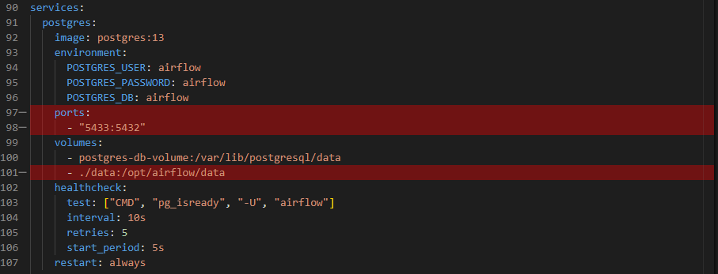

Add `dbt` and `data` directories to be created and to be readable in container (lines 242-243).


Now `docker-compose.yml` file is customized based on project needs.

#### Add requirements
Create a file `requirements.txt` and copy in it the content from below.
```
dbt-core==1.8.0
dbt-postgres==1.8.2
faker==18.4.0
polars==1.8.1
```

#### Create Dockerfile
As for current project the custom image is needed, create a `Dockerfile` and paste in it the content from below.\
It use `apache/airflow` image as a start point and customize it. Using `airflow` user, copy the `requirements.txt` into the container and install all dependencies from the file into the container. Copy the content of the `dbt` directory to the container.
```
# Use the official Airflow image as a template.
FROM apache/airflow:2.10.2

# Switch to airflow user to install packages.
USER airflow

# Copy the requirements file into the container.
COPY requirements.txt .

# Install all dependencies from the requirements file.
RUN pip install -r requirements.txt

# Copy dbt directory into the container.
COPY dbt /opt/airflow/dbt

```

### Create dbt
The SQL queries that were created for *testing environment* can be used for *development environment* as well, but as the project will grow, it will be hard to mentain all the processes inside the database. In order to have a scalable infrastructure for data modelling will be used **dbt**.\
Create a directory with name `dbt` and inside of it make a directory named `models`.
```
mkdir dbt
cd dbt
mkdir models
cd ../
```

#### Create project
In `dbt` directory create a file named `dbt_project.yml` and copy the content from below.
It will create a dbt project named *dbt_driven_data* that will use *default* profile and models from *models* directory.
```
name: 'dbt_driven_data'
version: '1.0'
profile: 'default'
model-paths: ["models"]
```

#### Create profiles
In `dbt` directory create a file named `profiles.yml` and copy the content from below.
It will define the *default* profile used in project with *dev* environment only. Also, here are defined characteristics of the database, including schema prefix `driven`.
```
default:
  target: dev
  outputs:
    dev:
      type: postgres
      host: postgres
      user: airflow
      password: airflow
      dbname: airflow
      schema: driven
      port: 5432
```

#### Create sources
In `dbt/models` create a file named `source.yml` and copy the content from below. It will create a source of data that can be used by many models - *raw_source*. The *raw_source* will be located in *airflow* database, in *driven_raw* schema, and the table for raw data is *raw_batch_data*.
```
version: 2

sources:
  - name: raw_source
    database: airflow
    schema: driven_raw
    tables:
      - name: raw_batch_data

  - name: staging_source
    database: airflow
    schema: driven_staging
    tables:
      - name: dim_address
      - name: dim_date
      - name: dim_finance
      - name: dim_person
      - name: fact_network_usage

  - name: trusted_source
    database: airflow
    schema: driven_trusted
    tables:
      - name: payment_data
      - name: technical_data
      - name: non_pii_data
      - name: pii_data
```

#### Create models
In `dbt/models` create a file named `staging_dim_address.sql` and copy the content from below.
```
{{ config(
    materialized='table',
    schema='staging',
    alias='dim_address',
    tags=['staging']
) }}

WITH source_data AS (
    SELECT
        unique_id,
        address,
        mac_address,
        ip_address
    FROM
        {{ source('raw_source', 'raw_batch_data') }}
)

SELECT
    *
FROM
    source_data
```

In `dbt/models` create a file named `staging_dim_date.sql` and copy the content from below.
```
{{ config(
    materialized='table',
    schema='staging',
    alias='dim_date',
    tags=['staging']
) }}

WITH source_data AS (
    SELECT
        unique_id,
        accessed_at
    FROM
        {{ source('raw_source', 'raw_batch_data') }}
)

SELECT
    *
FROM
    source_data
```

In `dbt/models` create a file named `staging_dim_finance.sql` and copy the content from below.
```
{{ config(
    materialized='table',
    schema='staging',
    alias='dim_finance',
    tags=['staging']
) }}

WITH source_data AS (
    SELECT
        unique_id,
        iban
    FROM
        {{ source('raw_source', 'raw_batch_data') }}
)

SELECT
    *
FROM
    source_data
```

In `dbt/models` create a file named `staging_dim_person.sql` and copy the content from below.
```
{{ config(
    materialized='table',
    schema='staging',
    alias='dim_person',
    tags=['staging']
) }}

WITH source_data AS (
    SELECT
        unique_id,
        person_name,
        user_name,
        email,
        phone,
        birth_date,
        personal_number
    FROM
        {{ source('raw_source', 'raw_batch_data') }}
)

SELECT
    *
FROM
    source_data
```

In `dbt/models` create a file named `staging_fact_network_usage.sql` and copy the content from below.
```
{{ config(
    materialized='table',
    schema='staging',
    alias='fact_network_usage',
    tags=['staging']
) }}

WITH source_data AS (
    SELECT
        unique_id,
        session_duration,
        download_speed,
        upload_speed,
        consumed_traffic
    FROM
        {{ source('raw_source', 'raw_batch_data') }}
)

SELECT
    *
FROM
    source_data
```

In `dbt/models` create a file named `trusted_payment_data.sql` and copy the content from below.
```
{{ config(
    materialized='table',
    schema='trusted',
    alias='payment_data',
    tags=['trusted']
) }}

WITH source_data AS (
    SELECT
        fnu.unique_id,
        df.iban,
        fnu.download_speed,
        fnu.upload_speed,
        fnu.session_duration,
        fnu.consumed_traffic,
        ((fnu.download_speed + fnu.upload_speed + 1)/2) + (fnu.consumed_traffic / (fnu.session_duration + 1)) AS payment_amount
    FROM
        {{ source('staging_source', 'fact_network_usage') }} fnu
    JOIN
        {{ source('staging_source', 'dim_finance') }} df
    ON
	    fnu.unique_id = df.unique_id
)

SELECT
    *
FROM
    source_data
```

In `dbt/models` create a file named `trusted_technical_data.sql` and copy the content from below.
```
{{ config(
    materialized='table',
    schema='trusted',
    alias='technical_data',
    tags=['trusted']
) }}

WITH source_data AS (
    SELECT
        fnu.unique_id,
        da.address,
        da.mac_address,
        da.ip_address,
        fnu.download_speed,
        fnu.upload_speed,
        ROUND((fnu.session_duration/60), 1) as min_session_duration,
        CASE 
            WHEN fnu.download_speed < 50 OR fnu.upload_speed < 30 OR fnu.session_duration/60 < 1 THEN true
            ELSE false
        END AS technical_issue
    FROM
        {{ source('staging_source', 'fact_network_usage') }} fnu
    JOIN
        {{ source('staging_source', 'dim_address') }} da
    ON
	    fnu.unique_id = da.unique_id
)

SELECT
    *
FROM
    source_data
```

In `dbt/models` create a file named `trusted_non_pii_data.sql` and copy the content from below.
```
{{ config(
    materialized='table',
    schema='trusted',
    alias='non_pii_data',
    tags=['trusted']
) }}

WITH source_data AS (
    SELECT
        '***MASKED***' AS person_name,
        SUBSTRING(dp.user_name, 1, 5) || '*****'  user_name,
        SUBSTRING(dp.email, 1, 5) || '*****' AS email,
        '***MASKED***'  AS personal_number, 
        '***MASKED***' AS birth_date, 
        '***MASKED***' AS address,
        '***MASKED***'  AS phone, 
        SUBSTRING(da.mac_address, 1, 5) || '*****' AS mac_address,
        SUBSTRING(da.ip_address, 1, 5) || '*****' AS ip_address,
        SUBSTRING(df.iban, 1, 5) || '*****' AS iban,
        dd.accessed_at,
        fnu.session_duration,
        fnu.download_speed,
        fnu.upload_speed,
        fnu.consumed_traffic,
        fnu.unique_id
    FROM
        {{ source('staging_source', 'fact_network_usage') }} fnu
    INNER JOIN
        {{ source('staging_source', 'dim_address') }} da ON fnu.unique_id = da.unique_id
    INNER JOIN
        {{ source('staging_source', 'dim_date') }} dd ON da.unique_id = dd.unique_id
    INNER JOIN
        {{ source('staging_source', 'dim_finance') }} df ON dd.unique_id = df.unique_id
    INNER JOIN
        {{ source('staging_source', 'dim_person') }} dp ON df.unique_id = dp.unique_id
)

SELECT
    *
FROM
    source_data
```

In `dbt/models` create a file named `trusted_pii_data.sql` and copy the content from below.
```
{{ config(
    materialized='table',
    schema='trusted',
    alias='pii_data',
    tags=['trusted']
) }}

WITH source_data AS (
    SELECT
        dp.person_name,
        dp.user_name,
        dp.email,
        dp.personal_number, 
        dp.birth_date, 
        da.address,
        dp.phone, 
        da.mac_address,
        da.ip_address,
        df.iban,
        dd.accessed_at,
        fnu.session_duration,
        fnu.download_speed,
        fnu.upload_speed,
        fnu.consumed_traffic,
        fnu.unique_id
    FROM
        {{ source('staging_source', 'fact_network_usage') }} fnu
    INNER JOIN
        {{ source('staging_source', 'dim_address') }} da ON fnu.unique_id = da.unique_id
    INNER JOIN
        {{ source('staging_source', 'dim_date') }} dd ON da.unique_id = dd.unique_id
    INNER JOIN
        {{ source('staging_source', 'dim_finance') }} df ON dd.unique_id = df.unique_id
    INNER JOIN
        {{ source('staging_source', 'dim_person') }} dp ON df.unique_id = dp.unique_id
)

SELECT
    *
FROM
    source_data
```

### Create Airflow
Once all previous stages are completed the project is in the same state as in *testing environment* where each part can be executed manually and individual. To promote the project to *develop environment* it will use Apache Airflow to orchestrate and manage the pipeline. In Airflow the pipeline is consisting from a DAG. Inside the DAG will be executed tasks that represent each stage that previously was executed manually. In this way it will manage dependencies between tasks and will succeed only if all tasks will succeed.

#### Run containers
To run the Airflow it is needed to run the Docker Containers that were created previously via `docker-compose.yml` and `Dockerfile` where the Airflow was setup.\
Make sure that the Docker Desktop is running. In VS Code open a terminal, make sure that you're in correct directory: `chapter_3/src_3`.
```
cd src_3
```
To build image and run Docker Compose use the command below.
```
docker-compose up --build
```
We should see execution of all steps from the `Dockerfile`.
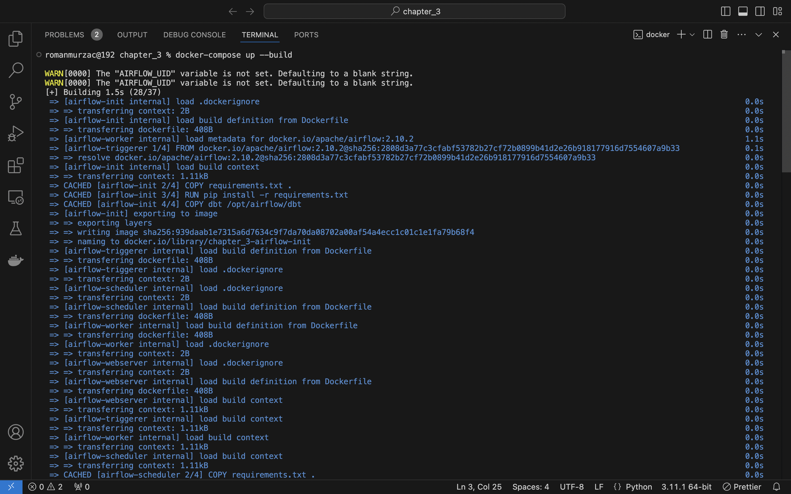

At the end of the building process you should see the *booting worker with pid* message. If you don't see the logs from the image below or have an error, please review previous steps of Docker setup.


Now in Docker Desktop you should see a suite of seven containers under name `chapter_3`.
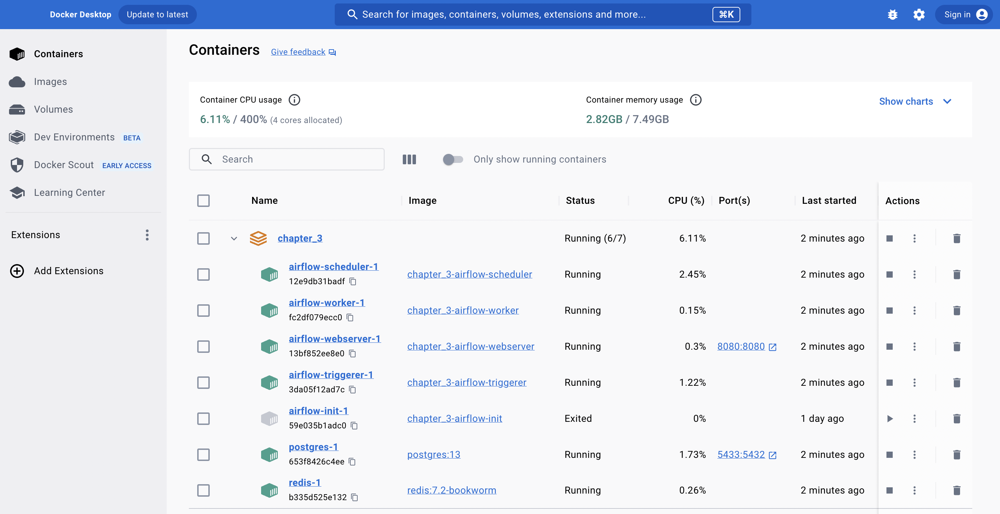

Also, now in Docker Desktop you should see a suite of seven images.
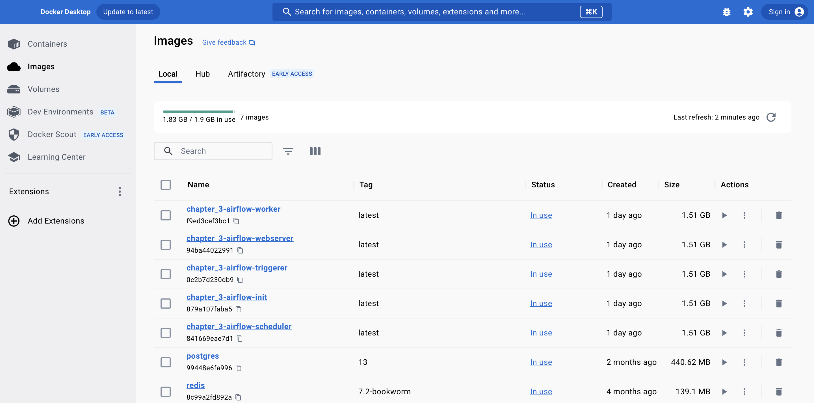

Also, in Docker Desktop you should see the volume attached to the database.


**Note:** If you want to rebuild the infrastructure, you have two main option: to remove only the containers and keep the volume with saved data in it or to remove containers and volume.\
To remove container use command below.
```
docker-compose down
```
To remove volumes use command below.
```
docker-compose down -v
```
The terminal will show logs from the image below and in Docker Container should be deleted all containers and volumes.


#### Login
Once all previous steps are done and the containers are up and running, access the Airflow local using `localhost:8080` address in your browser.\
Login with username `airflow` and password `airflow`.
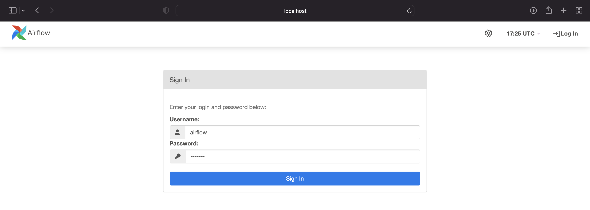

After successful login you'll see the Airflow interface where will be displayed DAGs and in `Admin` menu is `Connections` option that will be used.
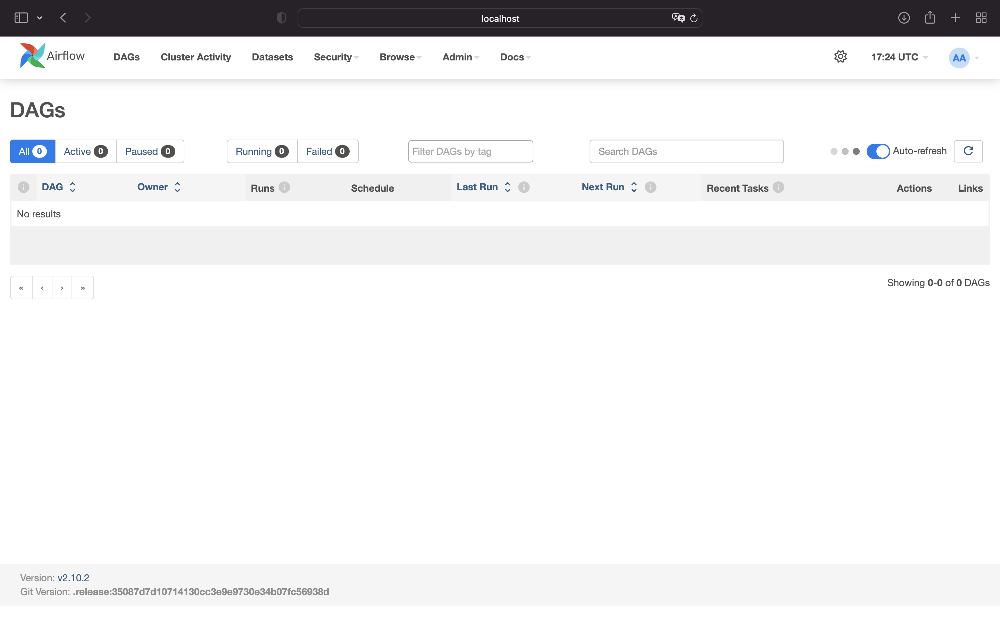

#### Setup Connection
Navigate to `Admin`->`Connection` menu and create new connection. Complete all fields as in image below.
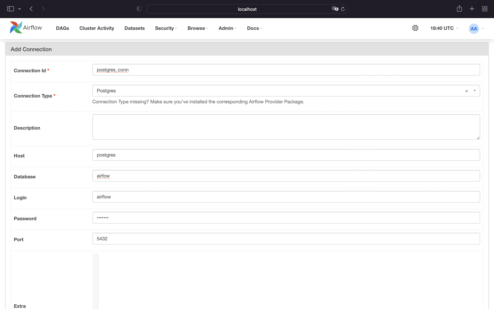

#### Create DAG
Create `driven_data_pipeline.py` file in `src_3/dags` directory.\
Define default arguments and the DAG parameters.
```
# Define the default arguments for DAG.
default_args = {
    'owner': 'airflow',
    'depends_on_past': False,
    'retries': 0,
}

# Define the DAG.
dag = DAG(
    'extract_raw_data_pipeline',
    default_args=default_args,
    description='DataDriven Main Pipeline.',
    schedule_interval="* 7 * * *",
    start_date=datetime(2024, 9, 22),
    catchup=False,
)
```

Define task for data extraction using Python Operator.
```
# Define extract raw data task.
extract_raw_data_task = PythonOperator(
    task_id='extract_raw_data',
    python_callable=save_raw_data,
    dag=dag,
)
```

Define task for raw schema creation, raw table data, and populate table in database with data from the CSV file using SQL Operator.
```
# Define create raw schema task.
create_raw_schema_task = SQLExecuteQueryOperator(
    task_id='create_raw_schema',
    conn_id='postgres_conn',
    sql='CREATE SCHEMA IF NOT EXISTS driven_raw;',
    dag=dag,
)

# Define create raw table task.
create_raw_table_task = SQLExecuteQueryOperator(
    task_id='create_raw_table',
    conn_id='postgres_conn',
    sql="""
        CREATE TABLE IF NOT EXISTS driven_raw.raw_batch_data (
            person_name VARCHAR(100),
            user_name VARCHAR(100),
            email VARCHAR(100),
            personal_number NUMERIC, 
            birth_date VARCHAR(100), 
            address VARCHAR(100),
            phone VARCHAR(100), 
            mac_address VARCHAR(100),
            ip_address VARCHAR(100),
            iban VARCHAR(100),
            accessed_at TIMESTAMP,
            session_duration INT,
            download_speed INT,
            upload_speed INT,
            consumed_traffic INT,
            unique_id VARCHAR(100)
        );
    """,
    dag=dag
)

# Define load CSV data into the table task.
load_raw_data_task = SQLExecuteQueryOperator(
    task_id='load_raw_data',
    conn_id='postgres_conn',
    sql="""
    COPY driven_raw.raw_batch_data(
    person_name, user_name, email, personal_number, birth_date,
    address, phone, mac_address, ip_address, iban, accessed_at,
    session_duration, download_speed, upload_speed, consumed_traffic, unique_id
    ) 
    FROM '/opt/airflow/data/raw_data.csv' 
    DELIMITER ',' 
    CSV HEADER;
    """
)
```

Run dbt models for staging and trusted zones by running taging models with specific tag using Bash Operator.
```
# Define staging dbt models run task.
run_dbt_staging_task = BashOperator(
    task_id='run_dbt_staging',
    bash_command='set -x; cd /opt/airflow/dbt && dbt run --select tag:staging',
)

# Define trusted dbt models run task.
run_dbt_trusted_task = BashOperator(
    task_id='run_dbt_trusted',
    bash_command='set -x; cd /opt/airflow/dbt && dbt run --select tag:trusted',
)
```

Define tasks running dependecies. Extracting data and create raw schema are independent and can be created in parallel, rest of the tasks are dependent and will run in series.
```
# Set the task in the DAG
[extract_raw_data_task, create_raw_schema_task] >> create_raw_table_task
create_raw_table_task >> load_raw_data_task >> run_dbt_staging_task
run_dbt_staging_task >> run_dbt_trusted_task
```

The full content of the DAG can be found in `src_3/dags` directory. After saving the file, as a result the DAG will be displayed in the Airflow environment.


Click on the DAG name and access it. In the DAG you'll see the tasks defined in DAG file as a column. In `Graph` section can be seen the schema of execution of the tasks
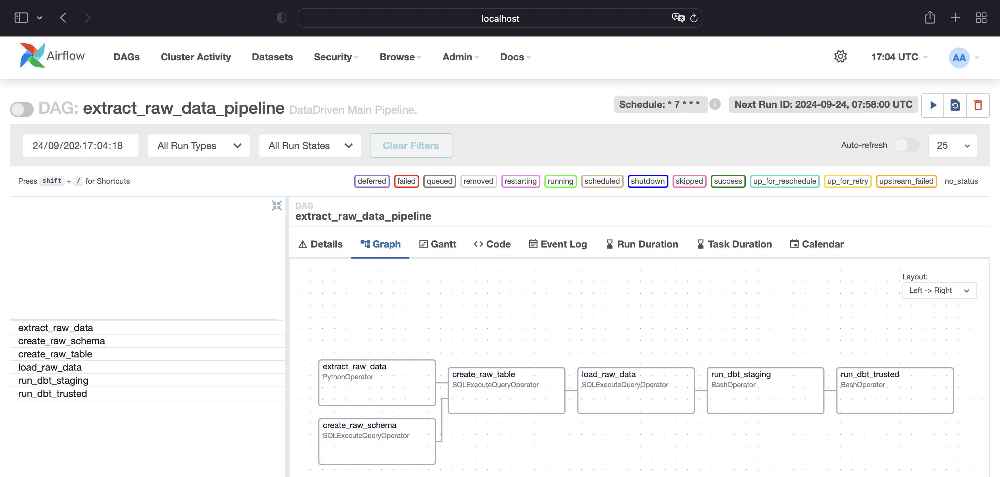

#### Run DAG
Play the DAG and it will run automatically at scheduled time, in this case it will run at 07:00 AM every day.
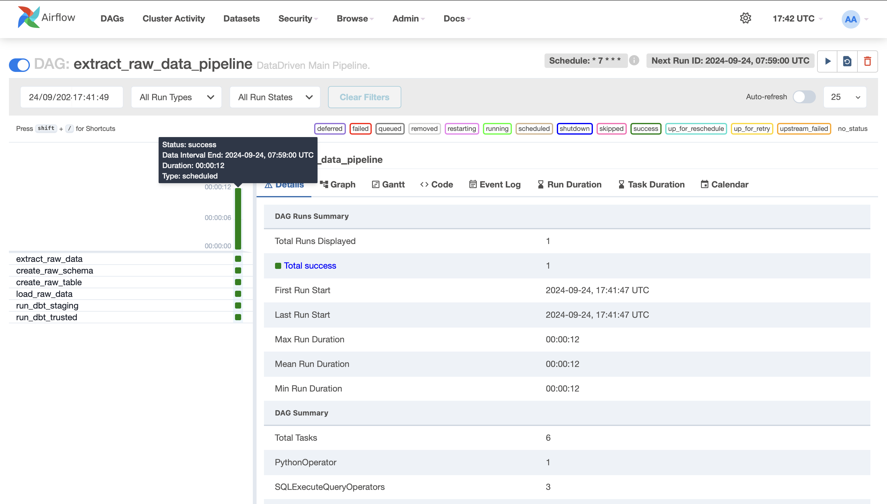

After running the DAG, click on specific task and access the `Logs` section and you can see the logs of execution.
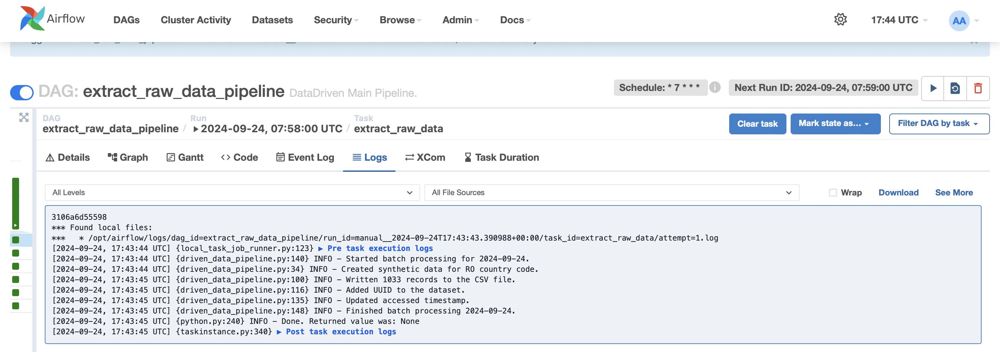

For dbt tasks you can see the that for each task from all available models were run only the models with specific tag.
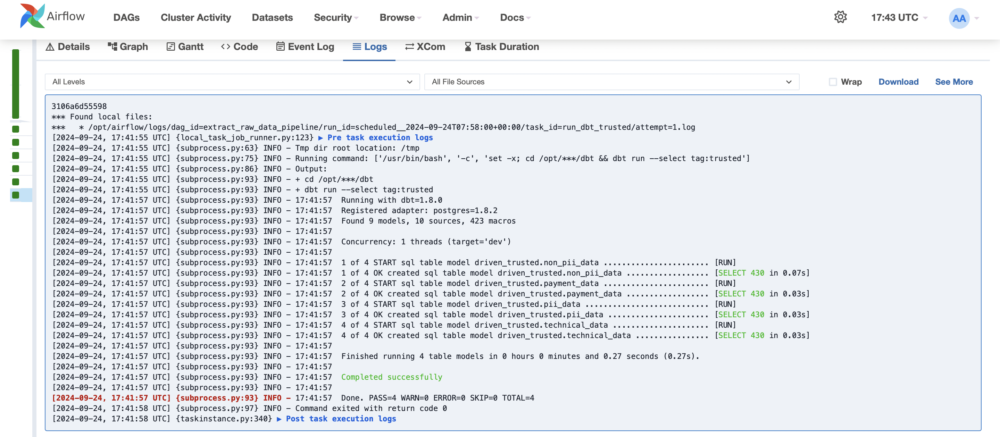

For each task can be seen the execution time.
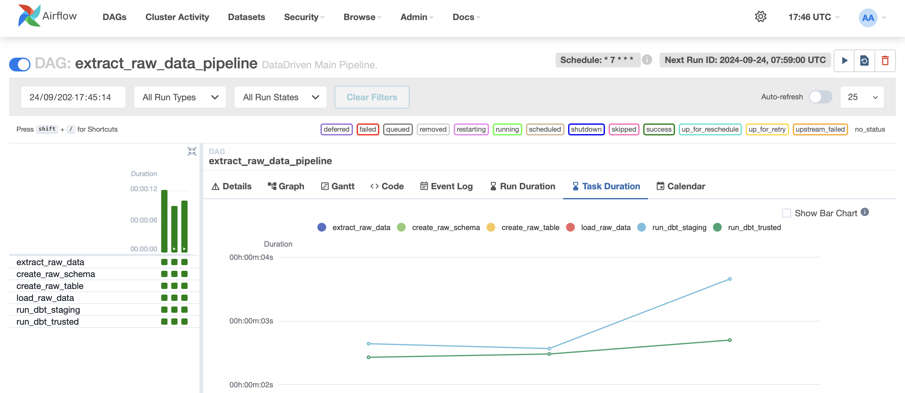

### Setup pgAdmin 4 database
Now, after the pipeline is up and running on daily basis, the data are available for using for further consumtion.
The data are available in trusted zone in four tables defined in `Chapter 2`.
Run *pgAdmin 4* and connect to the `airflow` database.

#### Connect to database
Create a server and name it `airflow`. In this server create a database and name it `airflow` with the parameters from the image below.
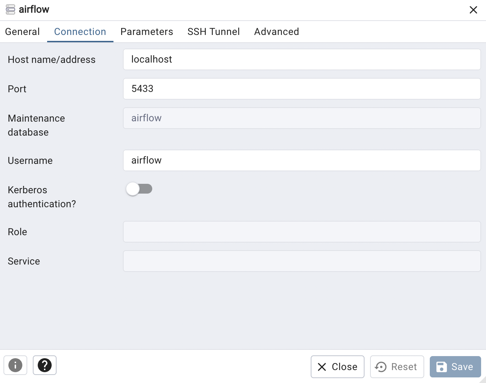

#### Check data in pipeline
In the `airflow` database navigate to `Schemas` it will be present all created schemas: `driven_raw`, `driven_staging`, and `driven_trusted` and in each schema are presented specific tables.
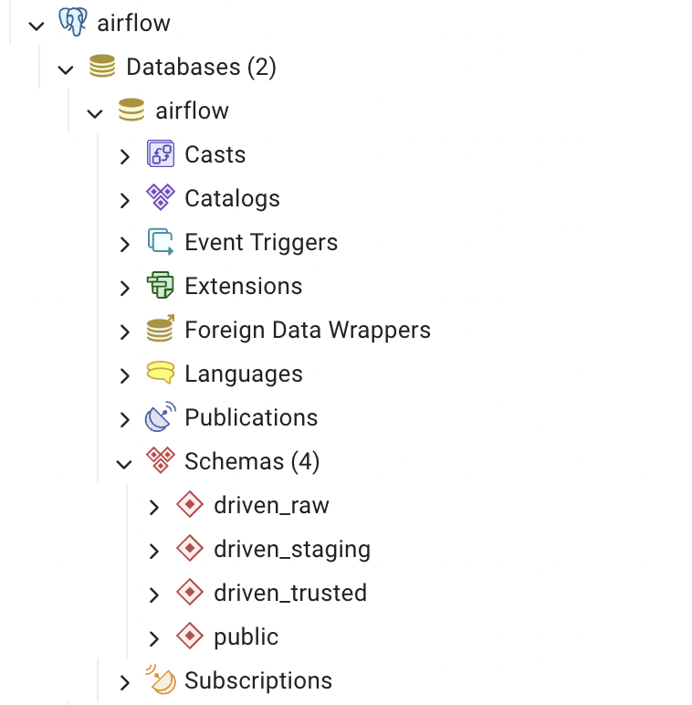

Now, using the queries from `Chapter 2`, just changing schema name, the database can be queried and used for company further work.
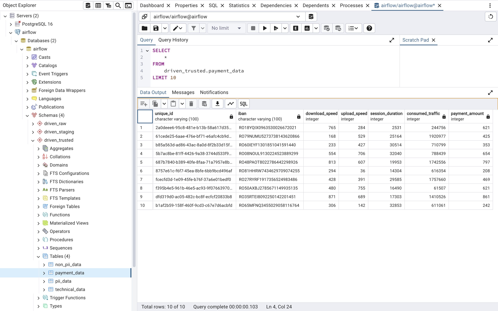

As the Airflow pipeline is up and running on daily basis at 07:00 AM based on schedule, the fresh data will be available before required time, 08:00 AM every day.