# **Chapter 4:** Batch processing - *Cloud: Console pipeline*

**NOTE:** This chapter involves working with cloud services that are charged by the cloud provider. Consult the [AWS Pricing Calculator](https://calculator.aws/#/) for a forecast of the estimated cost of the services used in this chapter. If you proceed with this chapter, you do so at your own responsibility, and the author has no responsibility for the resulting bill.

## Scenario
For the fourth chapter/sprint, you need to consolidate the pipeline that was developed on your local machine, optimize the pipeline processes, create the cloud architecture to ensure the product is robust and scalable, implement the proposed architecture via the AWS Console, and validate the *DataDriven* pipeline in the cloud.

## Assignment
For this Sprint / Chapter your tasks include:
1. **Read** the following topics in the [Theory](#theory) section:\
    a. Amazon Web Services:
    * i. S3.
    * ii. IAM.
    * iii. MWAA.
    * iv. Glue job.
    * v. Crawler.
    * vi. Athena.
    * vii. VPC.

2. **Implement** the steps in the [Practice](#practice) section for *DataDriven* company:\
    a. Setup AWS Console:
    * i. Login to AWS.
    * ii. Setup Console.

    b. Setup Services:
    * i. S3.
    * ii. VPC.
    * iii. MWAA.
    * iv. IAM.

    c. Create services:
    * i. Create Glue jobs.
    * ii. Create Athena database.
    * iii. Create Crawlers.
    
    d. Run DAG:
    * i. Create DAG.
    * ii. Run pipeline via DAG.

    e. Consume data:
    * i. Access Athena.
    * ii. Query data.

3. **Complete** tasks for *LeadData* company:
    * Review the *Scenario* section, complete the stages in the *Assignment*, and document your work in `work_4/scenario_4.md`. Store all evidence of your work in the `work_4` directory.

## Theory
The main theoretical notions for the chapter along with resources for self-paced learning.

### Simple Storage Service
#### Description
Amazon Simple Storage Service (Amazon S3) is an object storage service that offers industry-leading scalability, data availability, security, and performance. Customers of all sizes and industries can use Amazon S3 to store and protect any amount of data for a range of use cases, such as data lakes, websites, mobile applications, backup and restore, archive, enterprise applications, IoT devices, and big data analytics. Amazon S3 provides management features so that you can optimize, organize, and configure access to your data to meet your specific business, organizational, and compliance requirements.
#### References
[AWS - What is Amazon S3?](https://docs.aws.amazon.com/AmazonS3/latest/userguide/Welcome.html)\
[TechTarget - Amazon Simple Storage Service (Amazon S3)](https://www.techtarget.com/searchaws/definition/Amazon-Simple-Storage-Service-Amazon-S3)

### Identity Access Management
#### Description
Identity and access management (IAM or IdAM for short) is a way to tell who a user is and what they are allowed to do. IAM is like the bouncer at the door of a nightclub with a list of who is allowed in, who isn't allowed in, and who is able to access the VIP area. IAM is also called identity management (IdM).
#### References
[CloudFlare - What is identity and access management (IAM)?](https://www.cloudflare.com/learning/access-management/what-is-identity-and-access-management/)\
[AWS - AWS Identity and Access Management](https://aws.amazon.com/iam/)

### Managed Workflows for Apache Airflow
#### Description
Amazon Managed Workflows for Apache Airflow is a managed orchestration service for Apache Airflow that you can use to setup and operate data pipelines in the cloud at scale. Apache Airflow is an open-source tool used to programmatically author, schedule, and monitor sequences of processes and tasks referred to as workflows. With Amazon MWAA, you can use Apache Airflow and Python to create workflows without having to manage the underlying infrastructure for scalability, availability, and security. Amazon MWAA automatically scales its workflow execution capacity to meet your needs, Amazon MWAA integrates with AWS security services to help provide you with fast and secure access to your data.
#### References
[AWS - What Is Amazon Managed Workflows for Apache Airflow?](https://docs.aws.amazon.com/mwaa/latest/userguide/what-is-mwaa.html)\
[Boto3 - MWAA](https://boto3.amazonaws.com/v1/documentation/api/latest/reference/services/mwaa.html)

### Glue job
#### Description
AWS Glue is a serverless data integration service that makes it easy for analytics users to discover, prepare, move, and integrate data from multiple sources. You can use it for analytics, machine learning, and application development. It also includes additional productivity and data ops tooling for authoring, running jobs, and implementing business workflows.
#### References
[AWS - What is AWS Glue?](https://docs.aws.amazon.com/glue/latest/dg/what-is-glue.html)\
[AWS - AWS Glue API](https://docs.aws.amazon.com/glue/latest/dg/aws-glue-api.html)

### Crawler
#### Description
You can use an AWS Glue crawler to populate the AWS Glue Data Catalog with databases and tables. This is the primary method used by most AWS Glue users. A crawler can crawl multiple data stores in a single run. Upon completion, the crawler creates or updates one or more tables in your Data Catalog. Extract, transform, and load (ETL) jobs that you define in AWS Glue use these Data Catalog tables as sources and targets. The ETL job reads from and writes to the data stores that are specified in the source and target Data Catalog tables.
#### References
[AWS - Using crawlers to populate the Data Catalog](https://docs.aws.amazon.com/glue/latest/dg/add-crawler.html)\
[StackOverflow - What does an AWS Glue Crawler do](https://stackoverflow.com/questions/53608650/what-does-an-aws-glue-crawler-do)

### Athena
#### Description
Amazon Athena is a serverless, interactive analytics service built on open-source frameworks, supporting open-table and file formats. Athena provides a simplified, flexible way to analyze petabytes of data where it lives. Analyze data or build applications from an Amazon Simple Storage Service (S3) data lake and 30 data sources, including on-premises data sources or other cloud systems using SQL or Python. Athena is built on open-source Trino and Presto engines and Apache Spark frameworks, with no provisioning or configuration effort required.
#### References
[AWS - Amazon Athena](https://aws.amazon.com/athena/)\
[CloudZero - What Is AWS Athena? Here’s Everything You Need To Know](https://www.cloudzero.com/blog/aws-athena/)

### Virtual Private Cloud
#### Description
With Amazon Virtual Private Cloud (Amazon VPC), you can launch AWS resources in a logically isolated virtual network that you've defined. This virtual network closely resembles a traditional network that you'd operate in your own data center, with the benefits of using the scalable infrastructure of AWS.
#### References
[AWS - What is Amazon VPC?](https://docs.aws.amazon.com/vpc/latest/userguide/what-is-amazon-vpc.html)\
[GeeksforGeeks - Amazon VPC – Introduction to Amazon Virtual Private Cloud](https://www.geeksforgeeks.org/amazon-vpc-introduction-to-amazon-virtual-cloud/)

## Practice
Implemention for the practical part of the chapter.

### Setup AWS Console
As first interaction with AWS is the Console. Here you can test the services and also, you can test your features that you develop. This will be first approach to prove the concept of the pipeline in cloud.

#### Login to AWS
Access the [AWS Console](https://aws.amazon.com/console) and press `Sign In` button. Use `Root user` option and enter email address that you used to create de AWS account. After email address, on next page, enter the password.


#### Setup Console
Once you're logged into the AWS account, you'll see the console where you can do actions manually in cloud. This chapter is fully dedicated to manual development via console.
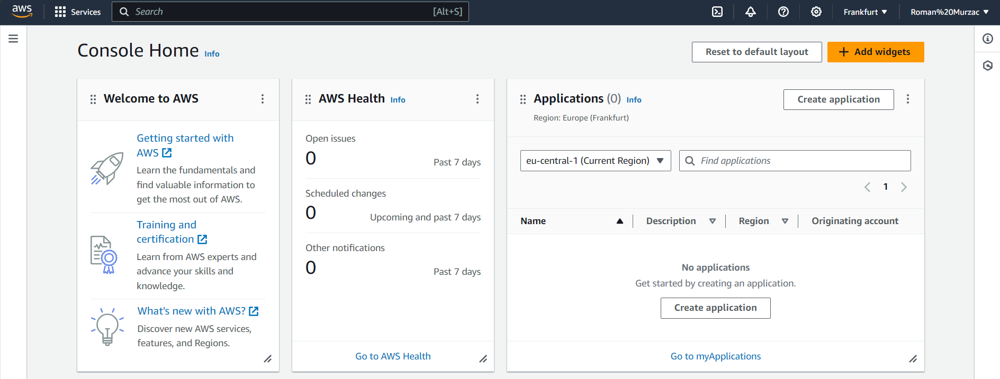

In the console are available two main options to access the AWS services: click on left panel `Console Home` and choose `All services` and central panel you'll see all services available in AWS Cloud arranged by category. Now you can click on desired services and configure them.
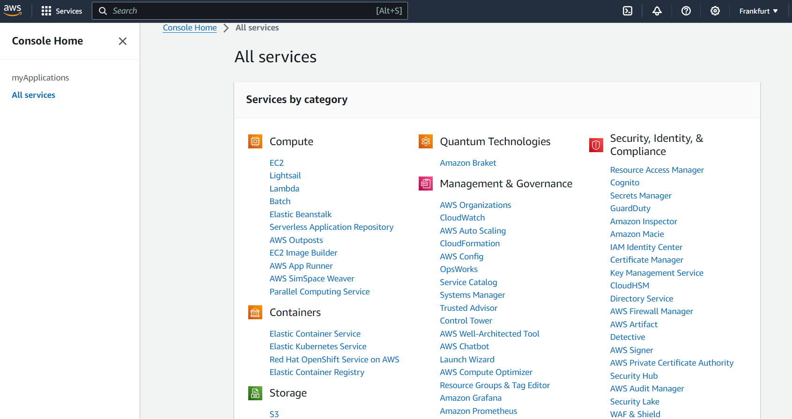

Also, in order to access a service in AWS Cloud you can just write the name of the service in the `Search` panel and the service will be listed. It is not mandatory to write the full name of the services to get them in list, it works even with abreviations.
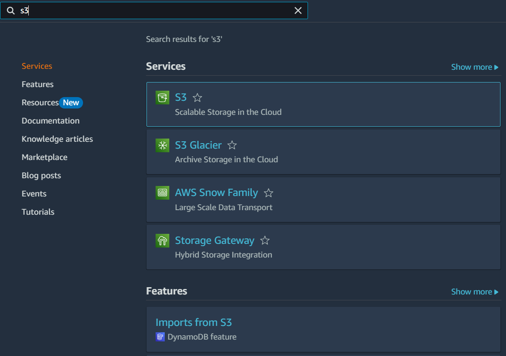

### Setup Services
In order to prove the concept for the pipeline developed for *DrivenData* it will be tested in cloud by setup each component one by one via Console.

#### S3 - Simple Storage Service
First service that will be used is S3 - Simple Storage Service is a storage that is used as datalake. Search or access from the list `S3` and access it. As there no buckets created yet, you should see an empty S3. 


Presson `Create bucket` provide the name `driven-data-bucket`, keep ACLs disabled.\


Also, disable `Block all public access`.\


Disable bucket versioning. Choose `SSE-S3` as encryption type. and enable bucket key usage.\


Press `create` and now you should see the bucket `driven-data-bucket` in S3 bucket list.\
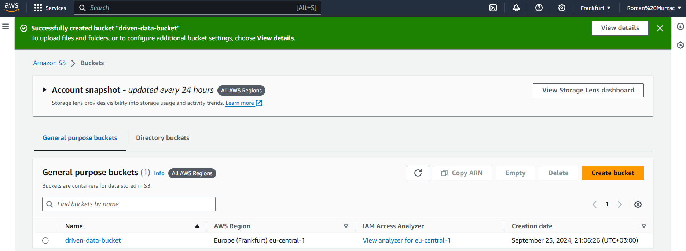

Click on bucket name and access it. Inside the bucket press `Upload` option and select `Add files` and choose file from *Chapter 2* - `batch_2024-09-14.csv`.


#### VPC - Virtual Private Cloud
In order to create the Airflow environment in AWS Cloud it is required to create or use the default Virtual Private Cloud. Search for `VPC` and in VPC options choose `Subnets`. Here you should see three default public subnets. It is needed to create at least two private subnets.\
Press `Create subnet` and in `VPC ID` choose the default VPC.\


Introduce the name of the subnet `private-zone-a`, choose as *Availability Zone* `eu-central-1a` and for *subnet CIDR block* choose the IP `nnn.nn.48.0/20`.\
Create one more subnet with the name `private-zone-b`, choose as *Availability Zone* `eu-central-1b` and for *subnet CIDR block* choose the IP `nnn.nn.64.0/20`.


Now you should see al five subnets: three default public subnets and two private subnets that were created.


You can create custom Security Group that will allow inbound and outbound traffic based on your specification. In this case the Security Group will have inbound traffic as `All traffic` referencing to itself. For outbound taffic specify `All traffic` with destination `0.0.0.0/0`.
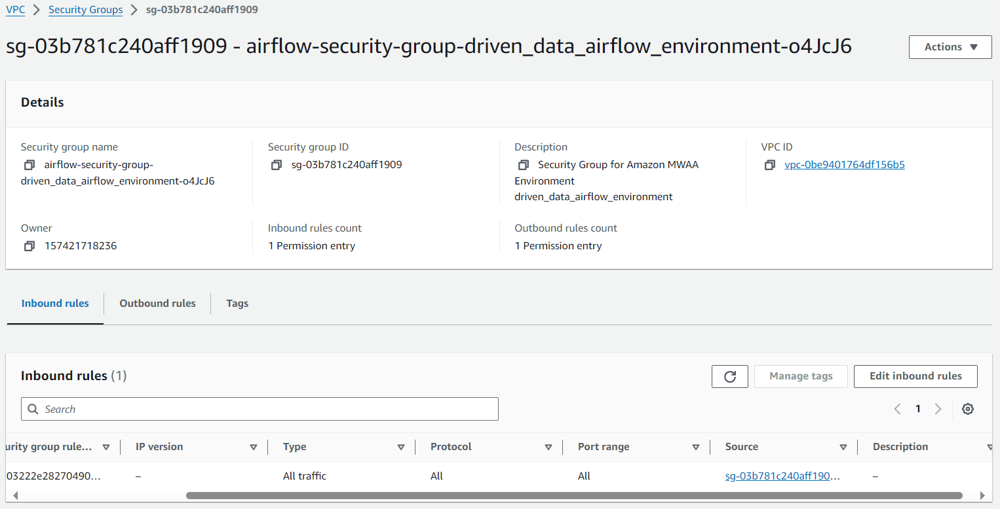

#### MWAA - Managed Workflows for Apache Airflow
Access `Airflow` and press on `Create environment`.
Enter `driven_data_airflow_environment` as *Name* in *Environment details* section. Choose latest version available for Airflow. As our pipeline should be available with fresh data daily at 08:00 AM, choose for `Weekly maintenance window start` after this time and prefered in weekend.\
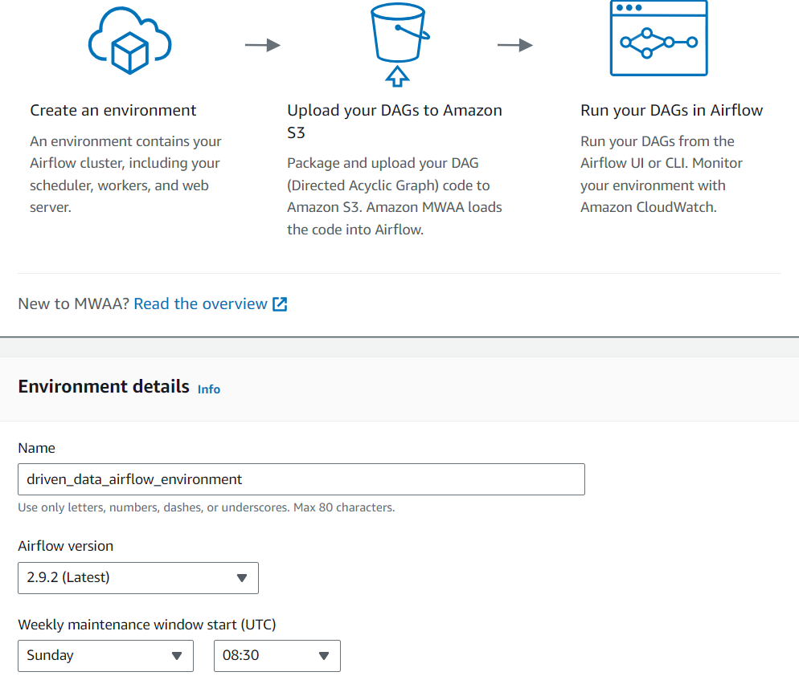

Press `Browse S3` and choose the bucket that was created before `driven-data-bucket` as *S3 Bucket*. Use same bucket for all options with specific directory inside such as: dags, lib for plugins and requirements. Plugins should be zipped and requirements should be in `txt` format. For this specific environment leave empty all fields beside first one with the bucket itself.\
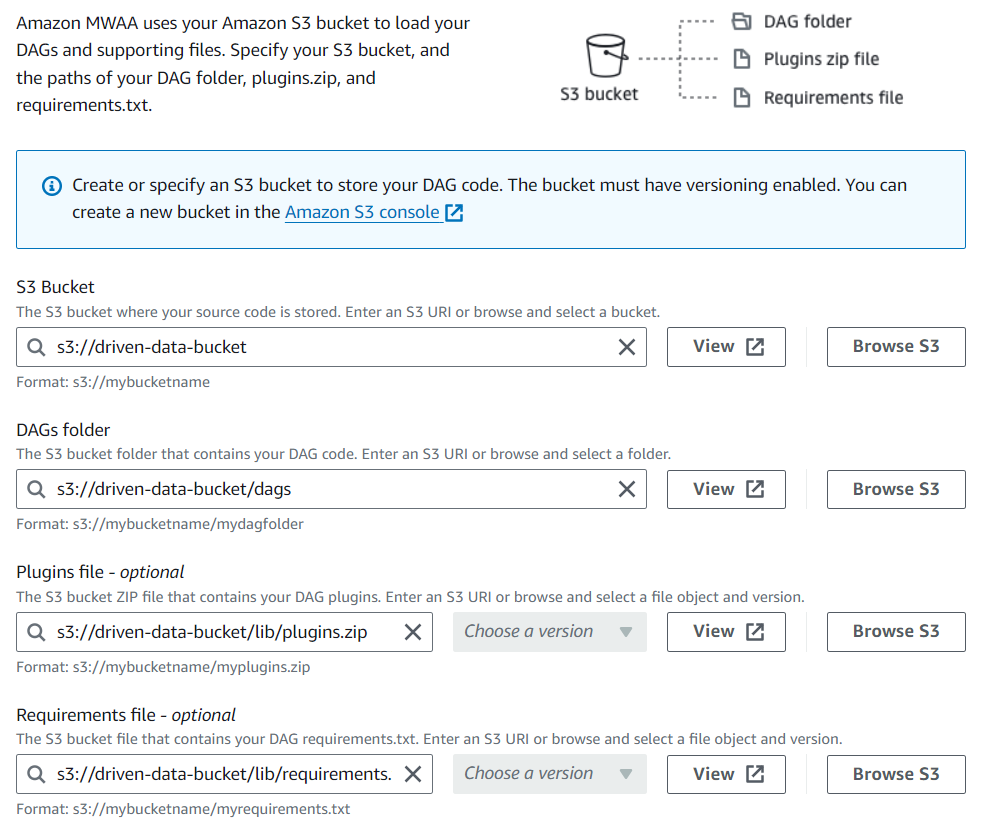

Choose `Create MWAA VPC` for `Virtual private cloud` option and a VPC will be create special to be used with the MWAA. This option will create as well the private subnets needed for MWAA setup. You can see created private subnets selected as `Subnet 1` and `Subnet 2`.\
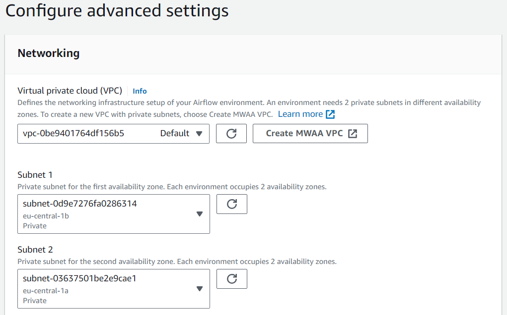

Choose `Private network (No internet accessible)` so this Airflow environment will be available only for the users with access to the VPC. Also, choose `Create new security group` to generate a Security Group special for the Airflow environment.\


Choose `Service managed endpoints` for *Endpoint management* option. As an *Environment class* choose `mw1.small`.\
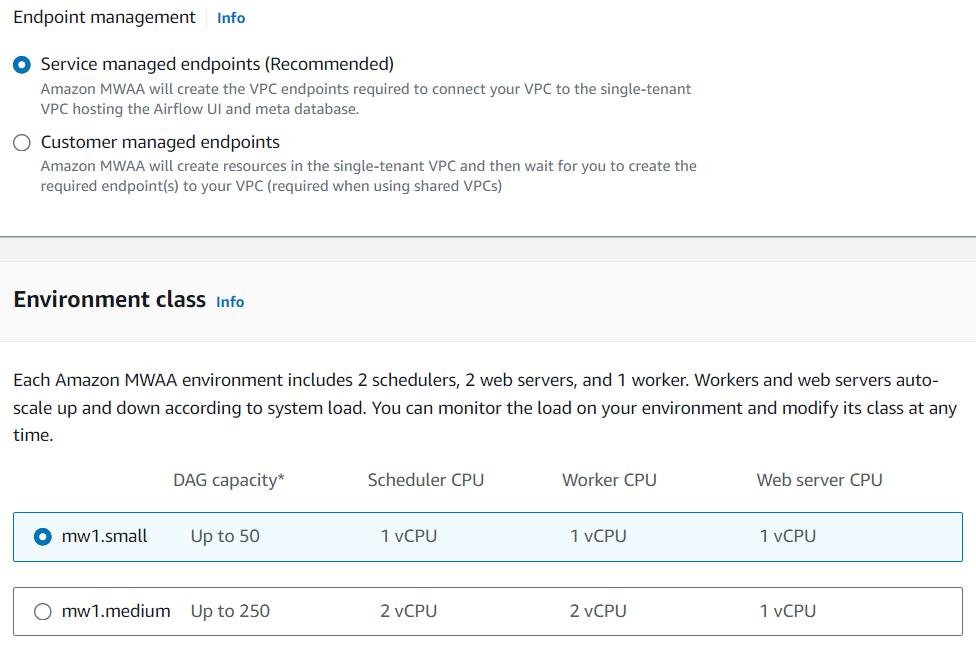

For *Permissions* option choose `Create a new role` as an *Execution role* and choose the name for *Role name* - can be left default name.\
At the end of all these operations, press `Review environment`, review all settings and press `Create environment`.\
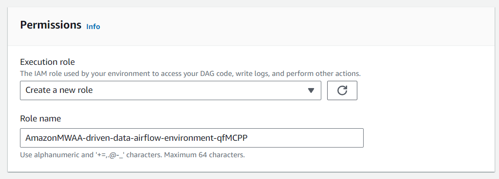

After setup the environment you'll se the environment creation process. In this window you can monitor if the creation process will be successful or some errors will occur. If any error occur, check the logs to see the error root cause and redeploy the environment after address the error.


The environment creation process will take around 30-45 minutes. If all settings were setup correctly we'll see the `Available` status after deployment is finished. Now you can use the MWAA to create the pipeline with the DAG.


Now you can access the MWAA using `Open Airflow UI` and create DAGs.


#### IAM - Identity Access Management
Access the IAM section and select `roles` option, here you should see all existing roles. Two roles should be related to the MWAA. First role is the role that was created for the MWAA and it was kept the original name and the second one is a service role for the MWAA.
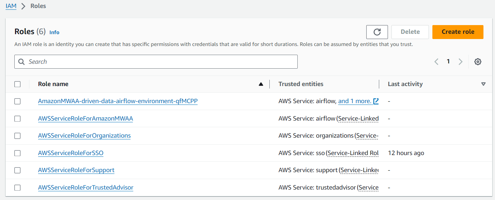

Click on the MWAA role and choose the `policy` section. Open the policy and here you'll see what permissions has the role via this policy. For example, the part in the image allow the role to list the buckets name and only for specific bucket with the name `driven-data-bucket`.
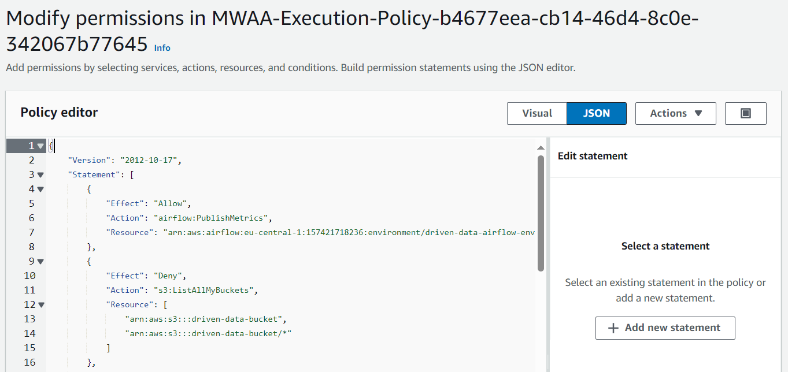

Add the statement below to the policy in order to allow the Airflow to run Glue jobs and Crawlers.\
First statement allow Airflow to get the list of existing Glue jobs and identify target one, second allow to start the Glue job, and the third one allow to get the status of the running job.\
Fourth statement allow Airflow to get the list of existing Crawlers and identify the target one, fifth allow to start the Crawler, and the sixth allow to get the status of the running Crawler.\
Now the policy for Airflow is ready to be used by Airflow role and perform all necessary tasks.\
Full policy for Airflow can be found in `policies/airflow-policy.json`. Replace `${aws_account_id}` with your account id.
```
{
    "Effect": "Allow",
    "Action": [
        "glue:GetJob",
        "glue:StartJobRun",
        "glue:GetJobRun",
        "glue:GetCrawler",
        "glue:StartCrawler",
        "glue:GetCrawlerMetrics"
    ],
    "Resource": [
        "*"
    ]
}
```

### Create services
After setup all necessary services, it is needed to create instances of services to proces data.

#### Create Glue jobs
Navigate to *Glue* service in AWS, and in *ETL jobs* select *Visual ETL* option.\
Click on `Visual ETL`, change the name to `staging_dim_address`, and navigate to `Script`. In *Script* section press `Edit script`, and replace the default content with the content from `tasks/staging_dim_address.py`. Navigate to `Job details` section and choose the *IAM Role* and create dedicated IAM Role and press `Save`.\
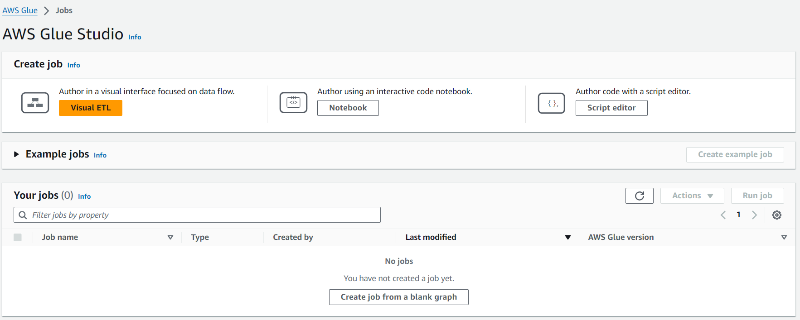

To the default glue role that was created add the policy from `policies/glue-policy.json` file.
```
{
    "Version": "2012-10-17",
    "Statement": [
        {
            "Effect": "Allow",
            "Action": [
                "s3:GetObject",
                "s3:PutObject",
                "s3:DeleteObject"
            ],
            "Resource": [
                "arn:aws:s3:::driven-data-bucket",
                "arn:aws:s3:::driven-data-bucket/*"
            ]
        }
    ]
}
```
For current pipeline will be needed 5 Glue jobs (for staging zone).
Create all five Glue jobs using files from `src_4/tasks` directory.
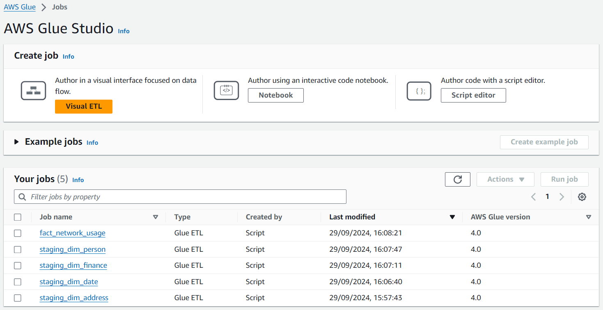

#### Create Athena database
Navigate to *Athena* service in AWS, and in *Administration* select *Data sources* option.\
In *Data Catalog* menu select `Databases`. Press `Add database` and enter `driven_data_db` as a *Name*.\
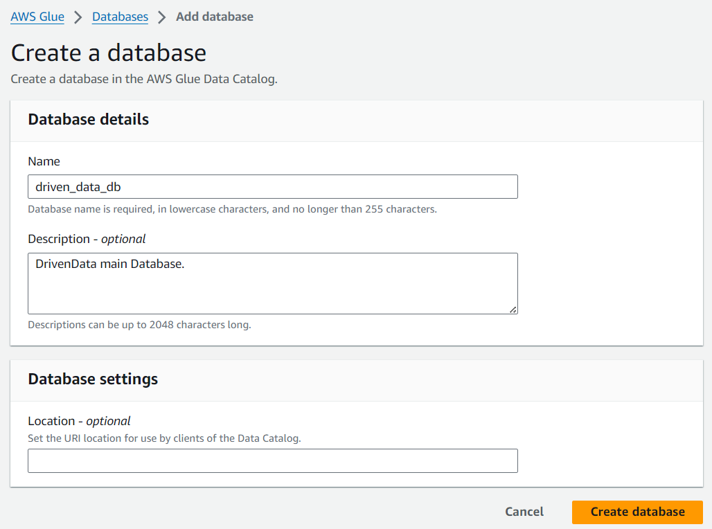

#### Create Crawlers
In *Data Catalog* menu select `Crawlers` option. Enter crawler name, choose S3 directory to be crawled, select the IAM role to be used, and choose the database as in image below. For each crawler change the S3 directory and the name.
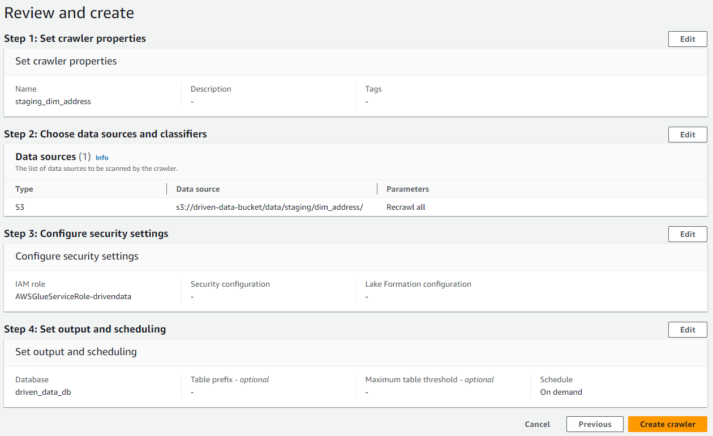

The names of the crawlers: `raw_driven_data`, `staging_dim_address`, `staging_dim_date`, `staging_dim_finance`, `staging_dim_person`, and `staging_fact_network_usage`.
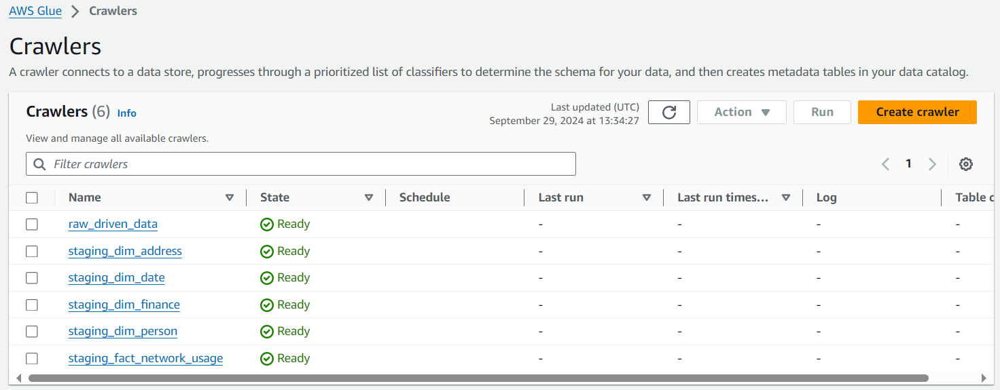

### Run DAG
Now it will be created a DAG that will manage and orchestrate all the services that were setup and will generate raw and staging data available in Athena for further usage.

#### Create requirements
First step will be to upload `requirements.txt` file to the S3 `driven_data_bucket` bucket. Content of the *requirements.txt* file can be found in `scr_4/requirements.txt` file.

#### Create Variables
In Airflow UI navigate to *Admin* menu and select `Variables` section. Add new variables, for key use `S3_BUCKET_NAME` and for value use `driven_Data_bucket`. Create another variable with key `S3_FILE_PATH` and value `data/raw/raw_batch_data`.

#### Create DAG
Keep logic from previous chapter for data generation, the DAG can be found in `src_4/dags/driven_Data_pipeline.py` file.\
**Note:** All processing activities should be handled by other AWS services, Airflow should only to orchestrate the pipeline.\
Create tasks for all Glue jobs and Crawlers, create pipeline execution flow.
```
# Set the task in the DAG.
extract_raw_data_task >> update_raw_task
update_raw_task >> [transform_address_task, transform_date_task, transform_finance_task, transform_person_task, transform_network_usage_task]
transform_address_task >> update_address_task
transform_date_task >> update_date_task
transform_finance_task >> update_finance_task
transform_person_task >> update_person_task
transform_network_usage_task >> update_network_usage_task
```


Copy DAG in `s3://driven-data-bucket/dags/` S3 directory and see the result in Airflow UI.


#### Run pipeline via DAG
Run the DAG, monitor all tasks execution for monitoring. Also, we can access *CloudWatch* to see the logs for each task in order to debug if any error occur.\
During the execution of a specific task you can check if the proper service is running and we'll se that Glue job or Crawler was triggered by Airflow DAG task.
Also we can see that all Glue jobs are running in parallel as they are not dependent on each other. Also, all staging crawlers are running in parallel after each specific Glue job finished.\
Example of successfully run Glue job.\
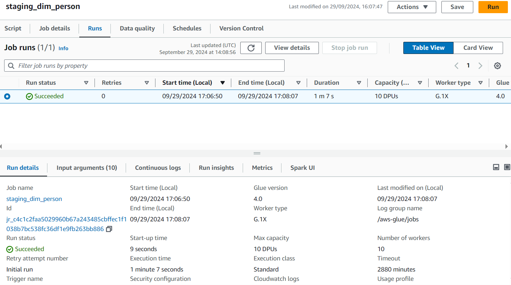

Example of all Crawlers with successfully last run.
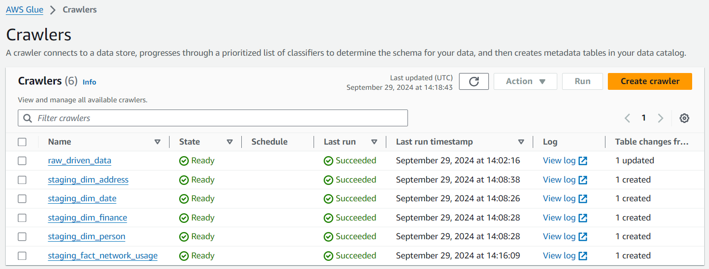

Example of the `driven_data_pipeline` DAG execution.
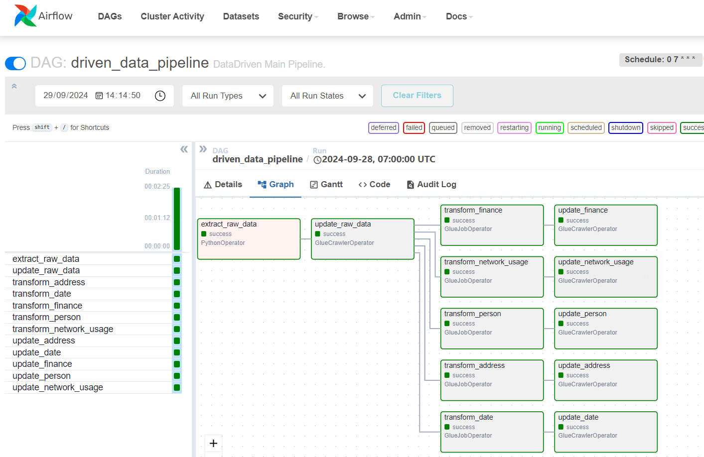

### Consume data
Once the DAG wqs running successfully, the data are available in Athena database. Here the Database Administrator should setup proper access for all user groups and data are ready for consumtion.

#### Access Athena
Access *Athena* and choose `driven_data_db` as database. You should see all six tables available.

#### Query data
Enter queries from previous chapter and query each table to check the result. You can save the query in Athena for daily check or on demand.\
Example query for raw data sample.
```
SELECT
    *
FROM
    raw
LIMIT
    10
```
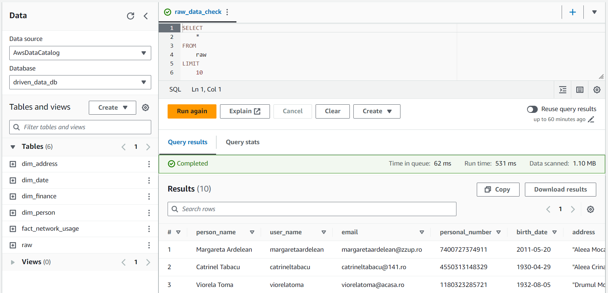

## Note
**Delete** all deployed resources after finishing the chapter as AWS Cloud resources are not free!
