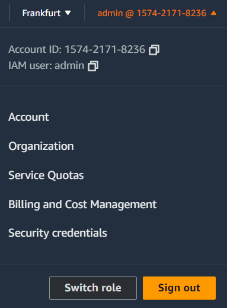
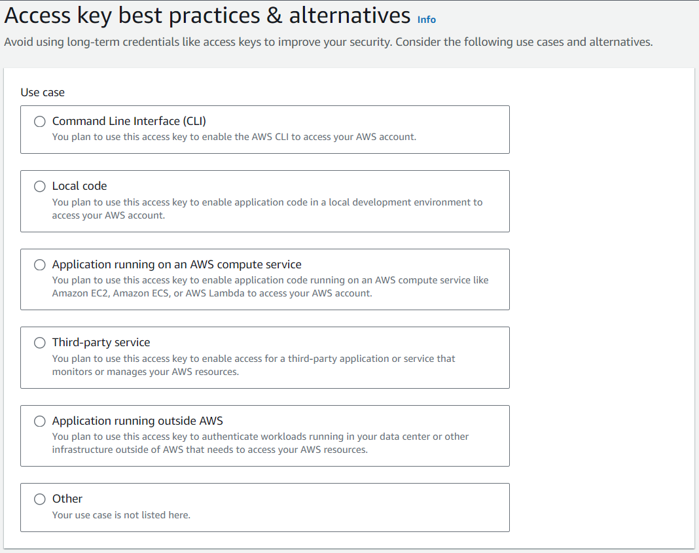
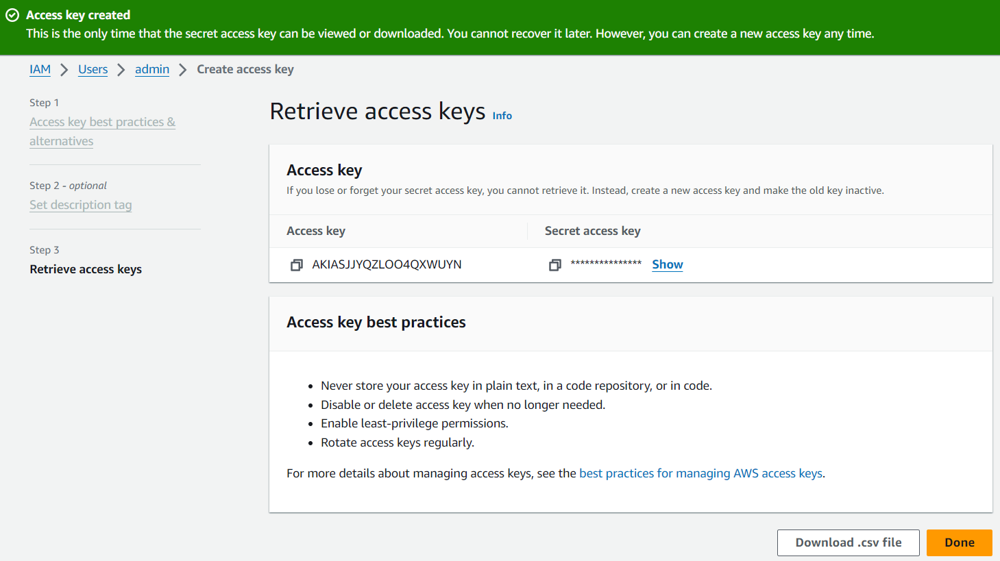
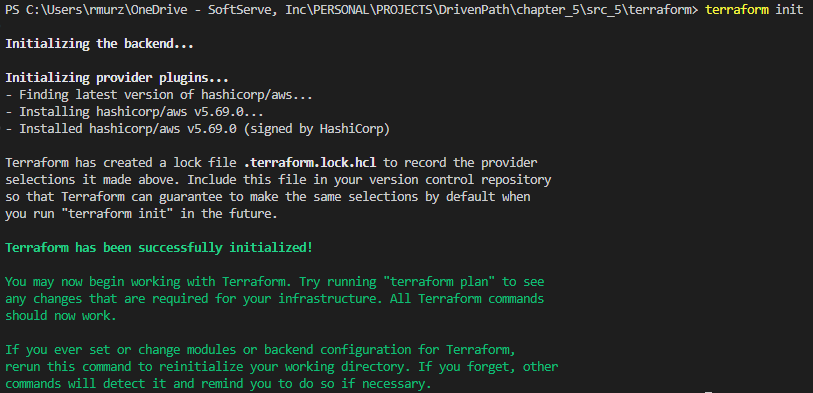
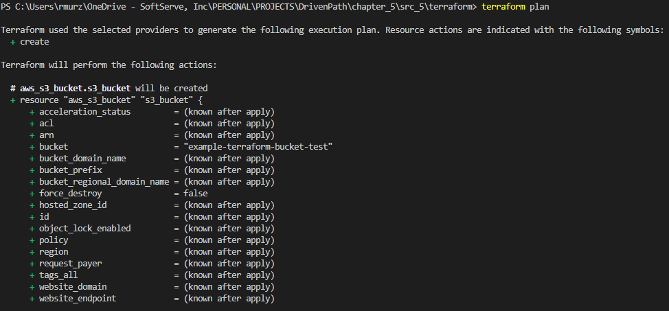

# **Chapter 5:** Batch processing - *Cloud: Automated pipeline*

## Scenario
For fifth Chapter / Sprint needs to automate the pipeline that was developed on AWS Cloud via Console. Make the pipeline to be deployed, updated, and destroyed on demand in automated way.

## Assignment
For current Sprint / Chapter your tasks are:
1. **Read** from [Theory](#theory) section about:\
    a. Terraform.

2. **Implement** from [Practice](#practice) section for *DataDriven* company:\
    a. Setup Services:
    * i. Create IAM user.
    * ii. Create Access key.
    * iii. Setup AWS CLI.
    * iv. Setup Terraform.
    
    b. Run Test Terraform:
    * i. Prepare Test Terraform.
    * ii. Run Terraform init.
    * iii. Run Terraform plan.
    * iv. Run Terraform apply.
    * v. Run Terraform destroy.

    c. Develop Terraform:
    * i. Prepare Terraform code.
    * ii. Run Terraform init.
    * iii. Run Terraform plan.
    * iv. Run Terraform apply.
    * v. Check deployed pipeline.
    * vi. Run Terraform destroy.

3. **Work** for *LeadData* company on Sprint / Chapter tasks:\
**Note:** For point 3 implementation, read current part of scenario from `scenario_5.md` file and put all your work evidences in `work_5` directory.

## Theory
Main theoretical notions of the chapter with proper resources for self paced learning.

### Terraform
#### Description
HashiCorp Terraform is an infrastructure as code tool that lets you define both cloud and on-prem resources in human-readable configuration files that you can version, reuse, and share. You can then use a consistent workflow to provision and manage all of your infrastructure throughout its lifecycle. Terraform can manage low-level components like compute, storage, and networking resources, as well as high-level components like DNS entries and SaaS features.
#### References
[HashiCorp - What is Terraform?](https://developer.hashicorp.com/terraform/intro)\
[IBM - What is Terraform?](https://www.ibm.com/topics/terraform)\
[GitHub - Terraform](https://github.com/hashicorp/terraform)

## Practice
Implemention for the practical part of the chapter.

### Setup services
Before proceed to automate the infrastructure, it is required to setup few things such as: create an IAM user in AWS, install AWS CLI, and install Terraform on your local machine.

#### Create IAM user
Login to your AWS account with the *root* user. Navigate to *IAM* service and choose `Users` option. Press `Create user` and provide a name to your user, recommended to be `admin` as it will have the same / almost the same rights as the *root* user. Check the `Provide user access to the AWS Management Console` option and choose `I want to create an IAM user`. For *Console password* choose any as the password will be reset on fist login and press `Next`. From `Permissions options` choose `Attach policies directly` and select `AdministratorAccess` policy. Press `Create user`.\
You'll receive URL for Console login, user name, and password.


Using received URL login to your account via created user `admin`. Use *Account ID* from your account.\


You'll be asked to reset the password. Introduce the old password that was generated on user creation process or password that you provided at that stage.


After login with the `admin` user, you'll see that instead of your account name there is specified the *admin* user.\


#### Generate Access key
Navigate to *IAM* service and choose *Users* section. Select user that was created previously. In *Summary* section press `Create access key` option. For *Access key best practices & alternatives* choose `Command Line Interface` option.


It will generate Access key and Secret access key, save these values as the Secret access key is available just once and press `Done`.


Now you can see that the user `admin` has one active *Access key* and when it was generated.\


#### Setup AWS CLI
Open a terminal and enter `aws --version` command to check if the *AWS CLI* is installed on your machine. If there is a message *aws is not recognized as an internal or external command*, follow the documentation to [Install or update to the latest version of the AWS CLI](https://docs.aws.amazon.com/cli/latest/userguide/getting-started-install.html#:~:text=Learn%20how%20to%20download%20and%20install). 
```
aws --version
```
After installing the *AWS CLI* check one more time the version of the *AWS CLI* on your machine. You should see *aws-cli n.nn.nn* this message indicates that installation was successful.\


Once the *AWS CLI* was installed, in terminal introduce the command `aws configure`, and introduce *AWS Access Key ID* that you saved previously, *AWS Secret Access Key* that you saved previously, *Default region name* as `eu-central-1`, and *Default output format* as `json` and press `Enter`.
```
aws configure
```


#### Setup Terraform
Open a terminal and enter `terraform version` command to check if the *Terraform* is installed on your machine. If there is a message *terraform is not recognized as an internal or external command*, follow the documentation to [Install Terraform](https://developer.hashicorp.com/terraform/install?product_intent=terraform). 
```
terraform version
```
After installing the *Terraform* check one more time the version of the *Terraform* on your machine. You should see *Terraform vn.nn.nn* this message indicates that installation was successful. 


### Run Test Terraform
Before starting to develop infrastructure code for *DrivenData* pipeline, it will be tested the setup. For setup test it will be deployed a test S3 bucket named `example-terraform-bucket-test`.

#### Prepare Test Terraform
Create `test_terraform` directory and inside create `main.tf` file and paste the code below.
```
provider "aws" {
  region = "eu-central-1"
}
```
In same directory create `s3.tf` file and copy the content below.
The code for `main.tf` and `s3.tf` can be found in `src_5/test_terraform` directory.
```
resource "aws_s3_bucket" "s3_bucket" {
  bucket = "example-terraform-bucket-test"
}
```

#### Run Terraform init
In terminal navigate to the `test_terraform` directory and run `terraform init` command. This command will initialize the terraform in this directory and will track the infrastructure in this directory.
```
terraform init
```


#### Run Terraform plan
In terminal run `terraform plan` command this command will prepare the resources to be deployed to the cloud, will check if there are no conflicts, and will display what resources will be created, updated, or deleted.
```
terraform plan
```


#### Run Terraform apply
In terminal run `terraform apply` command this command will apply all changes in the infrastructure that were planned on plan stage and the resources will be deployed to the cloud. You should type `yes` if you agree with all changes that will be made and press `Enter`.
```
terraform apply
```


Now you can navigate to *S3* service and see if the bucket was deployed. You should see the bucket with the name `example-terraform-bucket-test`.\


#### Run Terraform destroy
In terminal run `terraform destroy` command this command will destroy all changes in the infrastructure that were planned on plan stage and the resources will be deleted from the cloud. You should type `yes` if you agree with all changes that will be made and press `Enter`.
```
terraform destroy
```


### Develop Terraform
#### Prepare Terraform code
#### Run Terraform init
#### Run Terraform plan
#### Run Terraform apply
#### Check deployed pipeline
#### Run Terraform destroy