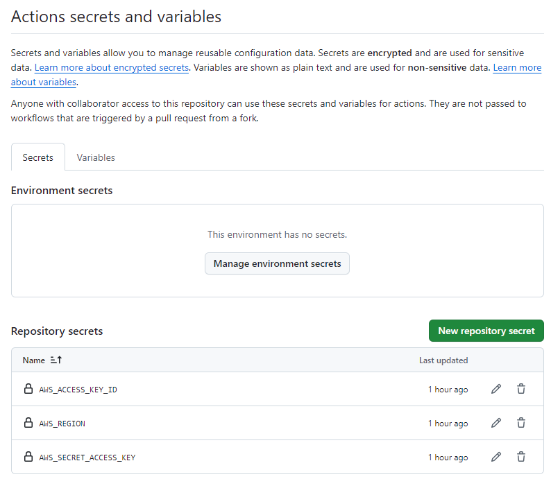
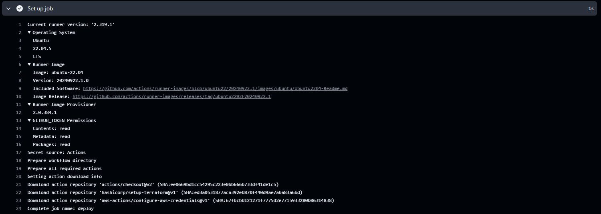
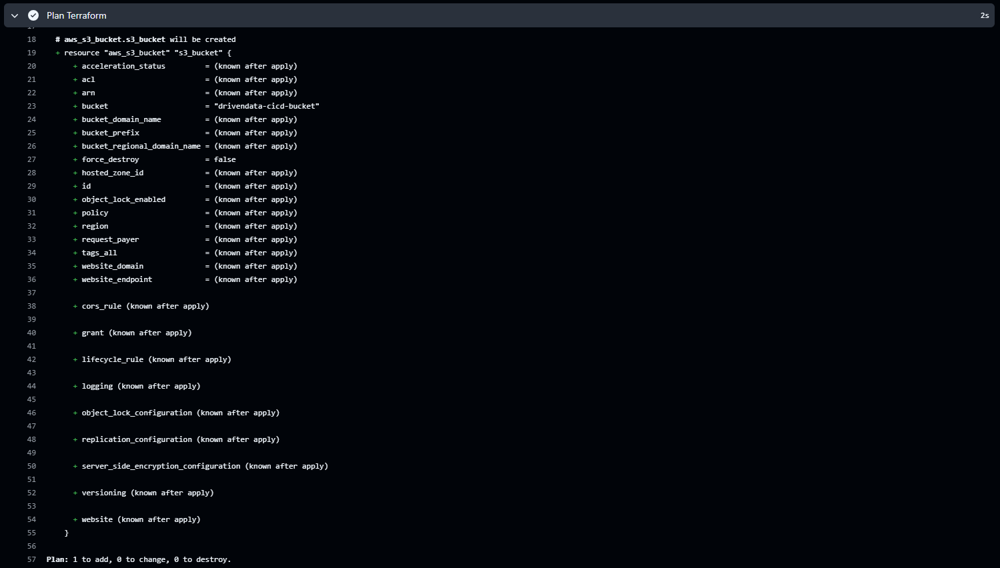
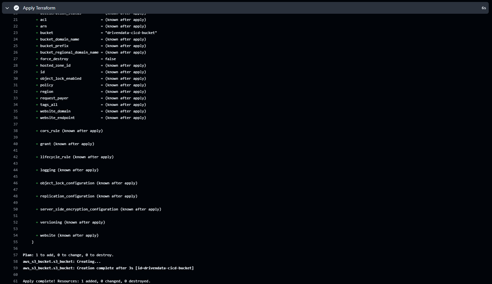
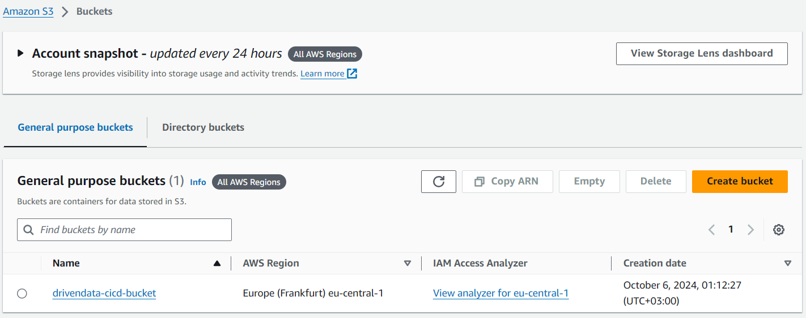

# **Chapter 6:** Batch processing - *CI/CD pipeline*

**NOTE:** This chapter involve work with cloud services that are charged by the cloud provider. Consult [AWS Pricing calculator](https://calculator.aws/#/) for forecast of the estimated cost of the services used for current chapter.\
If you proceed with this chapter this is on your own responsability and the author don't have any responsability for the resulted bill.

## Scenario
For sixth Chapter / Sprint it is required to implement Continuous Integration and Continuous Deployment for *DrivenData* pipeline in order to obtain fully automated process.

## Assignment
For current Sprint / Chapter your tasks are:
1. **Read** from [Theory](#theory) section about:\
    a. Continuous Integration and Continuous Deployment.
    b. GitHub Actions.

2. **Implement** from [Practice](#practice) section for *DataDriven* company:\
    a. Create GitHub secrets.
    b. Setup CI/CD:
    * i. Create deployment branch.
    * ii. Prepare code.
    * iii. Push code.
    * iv. Monitor deployment.
    * v. Check deployment.
    * vi. Further development.

3. **Work** for *LeadData* company on Sprint / Chapter tasks:\
Read chapter *Scenario*, implement all stages from *Assignment* from `work_6/scenario_6.md` file and put all your work evidences in `work_6` directory.

## Theory
Main theoretical notions of the chapter with proper resources for self paced learning.

### Continuous Integration and Continuous Deployment
#### Description
CI And CD is the practice of automating the integration of code changes from multiple developers into a single codebase. It is a software development practice where the developers commit their work frequently to the central code repository. Then there are automated tools that build the newly committed code and do a code review, etc as required upon integration.
The key goals of Continuous Integration are to find and address bugs quicker, make the process of integrating code across a team of developers easier, improve software quality, and reduce the time it takes to release new feature updates. 
#### References
[RedHat - What is CI/CD?](https://www.redhat.com/en/topics/devops/what-is-ci-cd)\
[GitLab - What is CI/CD?](https://about.gitlab.com/topics/ci-cd/)\
[Atlassian - Continuous integration vs. delivery vs. deployment](https://www.atlassian.com/continuous-delivery/principles/continuous-integration-vs-delivery-vs-deployment)

### GitHub Actions
#### Description
GitHub Actions is a continuous integration and continuous delivery (CI/CD) platform that allows you to automate your build, test, and deployment pipeline. You can create workflows that build and test every pull request to your repository, or deploy merged pull requests to production.
GitHub Actions goes beyond just DevOps and lets you run workflows when other events happen in your repository. For example, you can run a workflow to automatically add the appropriate labels whenever someone creates a new issue in your repository.
GitHub provides Linux, Windows, and macOS virtual machines to run your workflows, or you can host your own self-hosted runners in your own data center or cloud infrastructure.
#### References
[GitHub - Understanding GitHub Actions](https://docs.github.com/en/actions/about-github-actions/understanding-github-actions)\
[GitHub - Actions Cheat Sheet](https://github.github.io/actions-cheat-sheet/actions-cheat-sheet.html)\
[Dev - Getting Started with GitHub Actions: A Beginner’s Guide](https://dev.to/kanani_nirav/getting-started-with-github-actions-a-beginners-guide-og7)

## Practice
Implemention for the practical part of the chapter.

### Create GitHub secrets
Navigate to your [GitHub DrivenData repository](https://github.com/romanmurzac/DrivenPath), access `Settings` section and in `Security` module access `Secrets and variables` option and choose `Actions`.\
From *Actions* choose `Secrets` option and press `New repository secret`.\
Create a secret with *Name* `AWS_ACCESS_KEY_ID` and *Secret* with the value that you retrieved from your `AWS User Access Key`.\
Create a secret with *Name* `AWS_SECRET_ACCESS_KEY` and *Secret* with the value that you retrieved from your `AWS User Access Secret`.\
Create a secret with *Name* `AWS_REGION` and *Secret* with the value `eu-central-1`.


### Setup CI/CD
In order to use *GitHub Actions* here can be used manual setup by navigating to `Actions` section, press `New workflow` and from here choose or a *Template workflow*, or `set up a workflow yourself` option. In *DrivenData* project it will be setup via code.

### Create deployment branch
In order to prepare a CI/CD for *DrivenData* pipeline it will be needed to prepare a brand new branch - `deploy`. This branch will be used as an empty branch that not contains all works related to previous chapters. It needs to deploy only the desired infrastructure.\
Create `deploy` branch and delete all content from it.
```
git checkout --orphan deploy
git rm -rf .
```
### Prepare code
In `src_6` create a directory named `terraform` and it this directory create two files named `main.tf` and `s3.tf`.\
In `main.tf` file paste the content from below. It can be noticed that the content is the same as in previous terraform chapter.
```
provider "aws" {
  region = "eu-central-1"
}
```
In `s3.tf` file paste the content from below. This will create a S3 bucket named `drivendata-cicd-bucket`.
```
resource "aws_s3_bucket" "s3_bucket" {
  bucket = "drivendata-cicd-bucket"
}
```
In `src_6` create a directory named `.github` and it this directory create a subdirectory named `workflows`, and in the subdirectory create a file named `terraform-deploy.yml`. Paste the content from below.
```
name: DrivenData CI/CD pipeline

on:
  push:
    branches:
      - deploy

jobs:
  deploy:
    runs-on: ubuntu-latest

    steps:
      - name: Checkout code
        uses: actions/checkout@v2

      - name: Set up Terraform
        uses: hashicorp/setup-terraform@v1
        with:
          terraform_version: 1.9.7

      - name: Configure AWS credentials
        uses: aws-actions/configure-aws-credentials@v1
        with:
          aws-access-key-id: ${{ secrets.AWS_ACCESS_KEY_ID }}
          aws-secret-access-key: ${{ secrets.AWS_SECRET_ACCESS_KEY }}
          aws-region: ${{ secrets.AWS_REGION }}

      - name: Initialize Terraform
        run: terraform init

      - name: Plan Terraform
        run: terraform plan

      - name: Apply Terraform
        run: terraform apply -auto-approve
```
This file will create a workflow named `DrivenData CI/CD pipeline` that will trigger deployment only when there will be a `push` on `deploy` branch. It will create a *job* `deploy` that will run on *Ubuntu*. It will check the code and will install *Terraform 1.9.7*, will setup *AWS credentials*, and will run command for Terraform: `init`, `plan`, and `apply`.

### Push code
Once the code is ready and the branch contains only the structure described above it can be pushed to the remote branch.
```
git add .
git commit -m "Deploy: Initial deploy of a S3 bucket."
git push --set-upstream origin deploy
```

### Monitor deployment
Once the code was pushed to the remote branch, navigate to the GitHub repository and `Actions` section choose `DrivenData CI/CD pipeline`. It will run the deployment as in image below.


Click on the name of the workflow run and here will be displayed details about this current run. It can ve noticed that `terraform-deploy.yml` is used on `push` command.


Click on deploy and here will be displayed all stages of deployment. Can be noticed that stages are according with what was declared in `terraform-deploy.yml` file. `Set up job` and `Complete job` are default stages, rest of the stages are custom defined.


Open `set up job` stage and here it can be observed all settings used for this current job such as Operating System used, Image used, Provisioner, etc.


Open `Set up Terraform` stage and here can be observed that *Terraform 1.9.7* was used specified in the file.


Open `Initialize Terraform` stage and here can be observed that Terraform was initialized successfully.


Open `Plan Terraform` stage and here can be observed that Terraform executed follow plan: *1 to add, 0 to change, 0 to destroy* as was declared in `s3.tf` file.


Open `Apply Terraform` stage and here can be observed that Terraform applyed the plan and deployed the resources, in this case a S3 bucket.


### Check deployment
In your AWS account navigate to *S3* service and you can notice that there is a S2 bucket named `drivendata-cicd-bucket`.


### Further development
As the CI/CD is configured what needs to be done is to deploy the whole infrastructure via Terraform directly from GitHub repository. To achieve this just update the `terraform-deploy.yml` file and isntead of the `deploy` branch use value for the branch where the whole infrastructure where developed, in *DrivenData* project this branch is `chapter_5`.\
In order to *destroy* the infrastructure here can be added one more step that will destroy the infrastructure, but this can be used just for testing purpose as the infrastructure will be deleted imediatly. For development use another branch that will execute *destroy* command on existing infrastructure.\
**Note:** If you don't plan to use deployed infrastructure, is recommended to destroy it in order to avoid to be charged.