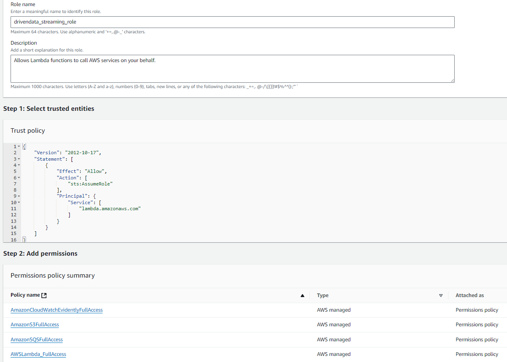
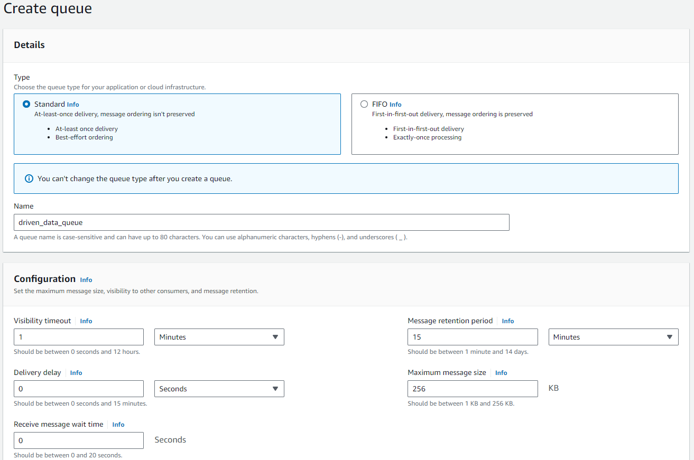
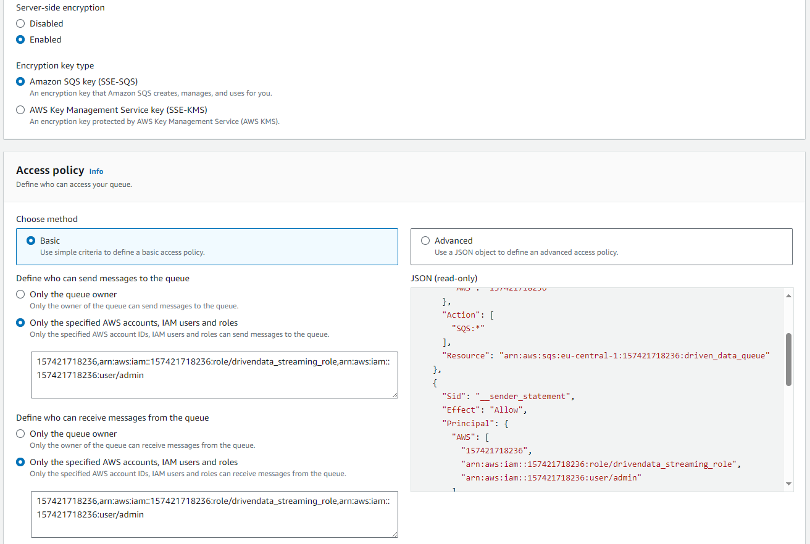
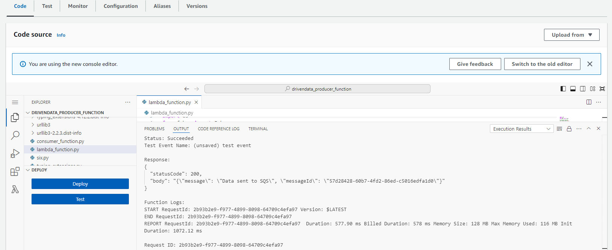
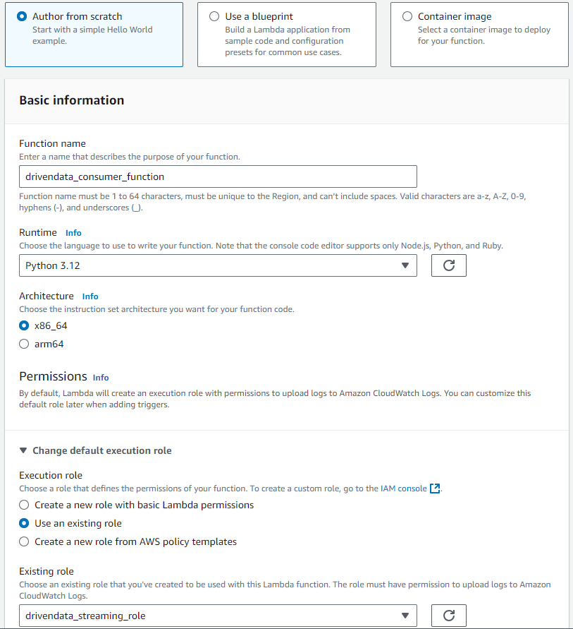
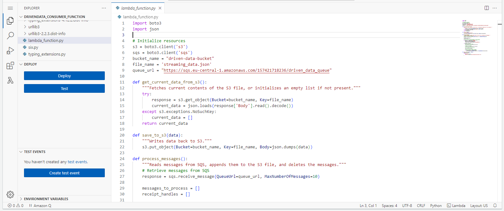
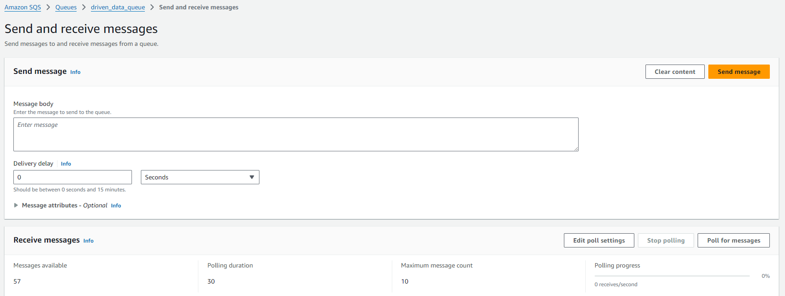
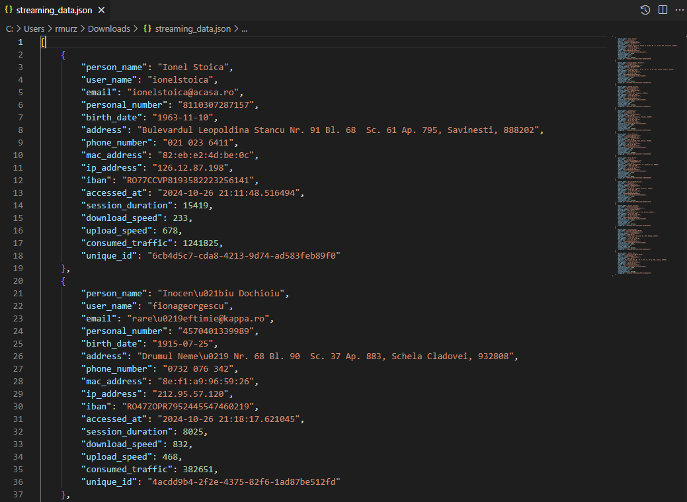

# **Chapter 8:** Streaming processing - *Cloud Pipeline*

**NOTE:** This chapter involve work with cloud services that are charged by the cloud provider. Consult [AWS Pricing calculator](https://calculator.aws/#/) for forecast of the estimated cost of the services used for current chapter.\
If you proceed with this chapter this is on your own responsability and the author don't have any responsability for the resulted bill.

## Scenario
For eighth Chapter / Sprint, the streaming data should be productionized and ingested in real time to the datalake in S3 bucket.

## Assignment
For current Sprint / Chapter your tasks are:
1. **Read** from [Theory](#theory) section about:\
    a. Lambda Function.\
    b. Simple Queue Service.\
    c. JSON.

2. **Implement** from [Practice](#practice) section for *DataDriven* company:\
    a. Create IAM role.

    b. Setup Simple Queue Service:
    * i. Create Simple Queue Service.
    * ii. Test Simple Queue Service.

    c. Setup producer Lambda function:
    * i. Create producer Lambda function.
    * ii. Test producer Lambda function.
    * iii. Run producer Lambda.

    d. Setup consumer Lambda function:
    * i. Create consumer Lambda function.
    * ii. Test consumer Lambda function.
    * iii. Run consumer Lambda.

    e. Validate pipeline:
    * i. Validate the Simple Queue Service.
    * ii. Validate the S3 data.

3. **Work** for *LeadData* company on Sprint / Chapter tasks:\
Read chapter *Scenario*, implement all stages from *Assignment* from `work_8/scenario_8.md` file and put all your work evidences in `work_8` directory.

## Theory
Main theoretical notions of the chapter with proper resources for self paced learning.

### Lambda Function
#### Description
Lambda runs your code on a high-availability compute infrastructure and performs all of the administration of the compute resources, including server and operating system maintenance, capacity provisioning and automatic scaling, and logging. With Lambda, all you need to do is supply your code in one of the language runtimes that Lambda supports. You organize your code into Lambda functions. The Lambda service runs your function only when needed and scales automatically. You only pay for the compute time that you consume—there is no charge when your code is not running.
#### References
[AWS - What is AWS Lambda?](https://docs.aws.amazon.com/lambda/latest/dg/welcome.html)\
[AWS - Create your first Lambda function](https://docs.aws.amazon.com/lambda/latest/dg/getting-started.html)\
[Terraform - Deploy serverless applications with AWS Lambda and API Gateway](https://developer.hashicorp.com/terraform/tutorials/aws/lambda-api-gateway)

### Simple Queue Service
#### Description
SQS enables web service applications that help to quickly and reliably queue messages. These messages have one component in their application that generates only when to be consumed by another component. Therefore, the queue is a temporary repository for messages and these messages are awaiting processing. So, Once these messages are processed, the messages also get deleted from the queue. AWS SQS service basically adds messages in a queue and then, Users will pick up these messages from the queue. A queue is a place where you can store your messages until they are extracted from the queue or expired.
#### References
[GeeksForGeeks - Amazon Web Services – Simple Queue Service(SQS): Complete Setup, Pricing, Features](https://www.geeksforgeeks.org/aws-sqs/)\
[AWS - What is Amazon Simple Queue Service](https://docs.aws.amazon.com/AWSSimpleQueueService/latest/SQSDeveloperGuide/welcome.html)\
[W3Schools - AWS Simple Queue Service](https://www.w3schools.com/aws/aws_cloudessentials_awssqs.php)

### JSON
#### Description
JSON (JavaScript Object Notation) is an open standard file format and data interchange format that uses human-readable text to store and transmit data objects consisting of attribute–value pairs and arrays (or other serializable values). It is a commonly used data format with diverse uses in electronic data interchange, including that of web applications with servers. JSON is a language-independent data format. It was derived from JavaScript, but many modern programming languages include code to generate and parse JSON-format data. JSON filenames use the extension .json. Douglas Crockford originally specified the JSON format in the early 2000s. He and Chip Morningstar sent the first JSON message in April 2001.
#### References
[JSON - Introducing JSON](https://www.json.org/json-en.html)\
[MDN - Working with JSON](https://developer.mozilla.org/en-US/docs/Learn/JavaScript/Objects/JSON)\
[W3Schools - What is JSON?](https://www.w3schools.com/whatis/whatis_json.asp)

## Practice
Implemention for the practical part of the chapter.

### Create IAM role
Navigate to *IAM* servive in AWS and choose *Role* section. Create a new role by choosing `AWS service` for the *Trusted entity type*. Select `Lambda` option for the *Use case*.\


Choose `AWSLambda_FullAccess`, `AWSCloudWatchEvidentlyFullAccess`, `AmazonSQSFullAccess` and `AmazonS3FullAccess` policies. The policies should allow access only to run a specific resources and to read and write to a specific bucket, the policies can be updated accordingly. Enter `drivendata_streaming_role` for the *Role name* option. \


### Setup Simple Queue Service
The streaming data, as per current volume and velocity, will be ingested using Amazon Simple Queue Service.

#### Create Simple Queue Service
Navigate to *SQS* service in AWS. Select `Create queue` and create a brand new queue.\


Choose `Standard` for *Type* option. Enter `driven_data_queue` for *Name*. Setup the *Configuration* options as per image below - 1 minute for visibility, 15 mins for retention and 256 kB for the message size, without delay.\


Choose `Enabled` for *Server side encryption*, `SSE-SQS` for *Encryption key type*. Select `Basic` for *Access policy*. Specify for send and receive only the specified AWS accounts, IAM users and roles. Enter the account number, admin user of the account, and the role that was created above.\


#### Test Simple Queue Service
After the queue was created, send a test message to check if the queue is working as expected. Enter a message in *Message body* section and press `Send message`. Press `Poll for messages` and the message will appear in section *Messages*, click on the message ID.\


### Setup producer Lambda function
The producer will be handled by a Lambda Function and will send data to the queue. Select `Create a function` option and create a Lambda function for the producer.\


#### Create producer Lambda function
Select `Author from scratch` option. Enter `drivendata_producer_function` for the *Function name*. Select `Python 3.12` for the *Runtime* option. Select `Use an existing role` and select the role that was created above.\


Now tha Lambda function is created and can be updated in order to fullfill all necessary configurations.\


In *Code* section can be seen the initial code for the Lambda function that will be executed.\
In `work_8` directory create a subdirfectory and name it `producer`. In created subdirectory create a file named `requirements.txt` and paste the content from below.
```
boto3
faker
```

In `producer` directory create a file name it `lambda_function.py`. Paste the content from below into this file. Here will be created function that will generate the synthetic data based on required schema. Replace the AWS account ID with your own account ID.
```
import boto3
import json
import time
import random
import logging
from datetime import datetime
from faker import Faker

logging.basicConfig(
    level=logging.INFO,
    format='%(asctime)s - %(levelname)s - %(message)s',
    datefmt='%Y-%m-%d %H:%M:%S',
    handlers=[logging.StreamHandler()]
)

sqs = boto3.client('sqs')
queue_url = "https://sqs.eu-central-1.amazonaws.com/<your_aws_account_id>/driven_data_queue"
synthetic = Faker()


def create_data(locale: str) -> Faker:
    logging.info(f"Creating synthetic data for {locale}.")
    return Faker(locale)


def generate_record(fake: Faker) -> dict:
    streaming_data = {
        "person_name": fake.name(),
        "user_name": fake.name().replace(" ", "").lower(),
        "email": f'{fake.name().replace(" ", "").lower()}@{fake.free_email_domain()}',
        "personal_number": fake.ssn(),
        "birth_date": str(fake.date_of_birth()),
        "address": fake.address().replace("\n", ", "),
        "phone_number": fake.phone_number(),
        "mac_address": fake.mac_address(),
        "ip_address": fake.ipv4(),
        "iban": fake.iban(),
        "accessed_at": str(datetime.now()),
        "session_duration": random.randint(0, 36000),
        "download_speed": random.randint(0, 1000),
        "upload_speed": random.randint(0, 800),
        "consumed_traffic": random.randint(0, 2000000),
        "unique_id": fake.uuid4()
    }
    logging.info("Generated synthetic data record.")
    return streaming_data
```

Create a function that will produce data and willwill push the to the *Amazon SQS* queue that was created above.
```
def produce_data(time_limit=15) -> None:
    start_time = datetime.now()
    fake_data_generator = create_data("ro_RO")
    while (datetime.now() - start_time).seconds < time_limit * 60:
        streaming_data = generate_record(fake_data_generator)
        logging.info(f"Generated data: {streaming_data}")
        response = sqs.send_message(
            QueueUrl=queue_url,
            MessageBody=json.dumps(streaming_data)
        )
        logging.info(f"Sent message ID: {response['MessageId']} to SQS.")
        time.sleep(random.randint(1, 15))
```

Create another function that will run the Lambda function itself.
```
def lambda_handler(event, context) -> dict:
    result = produce_data()
    return {
        'statusCode': 200,
        'body': json.dumps(result)
    }
```

In `producer` subdirectory create a file named `create_package.sh` that will create the Lambda package that will contain all necessary packages and custom files. Paste in the file the content from below.
```
#!/bin/bash

LAMBDA_FUNCTION_NAME="lambda_function"
ZIP_FILE="lambda_function.zip"

if [ -f "$ZIP_FILE" ]; then
    echo "Removing old $ZIP_FILE..."
    rm "$ZIP_FILE"
fi

mkdir -p producer_package

echo "Installing dependencies..."
pip install -r requirements.txt --target producer_package/

echo "Copying lambda_function.py..."
cp "$LAMBDA_FUNCTION_NAME.py" producer_package/

cd producer_package
echo "Creating deployment producer_package..."

zip -r9 "../$ZIP_FILE" .

cd ..
rm -rf producer_package
```

In terminal navigate to the `chapter_8/work_8/producer/` directory and run the bash script that will generate the Lambda package to be uploaded to the Lambda.
```
cd chapter_8/work_8/producer/
bash create_package.sh
```


#### Test producer Lambda function
Choose option `Upload from`, select `zip file` and choose from your local disk the archieved lambda function that was generated with the name `lambda_function.zip`.\
Navigate to the `Test` section and press option `Test`. It will run the Lambda function and there will be execution logs under *Details* option.\


#### Run producer Lambda.
Once the Lambda function was created, updated and tested the code can be executed. Before execute the code, navigate to the `Configuration` section and edit the `Timeout` option to `15 min` instead of `3 sec`. Now the Lambda function can be run by pressing `Test` button and observe the execution logs.\


### Setup consumer Lambda function
The consumer will be handled by a Lambda function that will consume data from the queue and will write data to the S3 bucket. Select `Create a function` option and create a Lambda function for the consumer.

#### Create consumer Lambda function
Select `Author from scratch` option. Enter `drivendata_consumer_function` for the *Function name*. Select `Python 3.12` for the *Runtime* option. Select `Use an existing role` and select the role that was created above.\


Now tha Lambda function is created and can be updated in order to fullfill all necessary configurations.\


In `work_8` directory create a subdirfectory and name it `consumer`. In created subdirectory create a file named `requirements.txt` and paste the content from below.
```
boto3
```

In `consumer` directory create a file name it `lambda_function.py`. Paste the content from below into this file. Here will be created function that will get the data from S3 bucket and will write data to the S3 bucket.
```
import boto3
import json
import logging

logging.basicConfig(
    level=logging.INFO,
    format='%(asctime)s - %(levelname)s - %(message)s',
    datefmt='%Y-%m-%d %H:%M:%S',
    handlers=[logging.StreamHandler()]
)

s3 = boto3.client('s3')
sqs = boto3.client('sqs')
bucket_name = "driven-data-bucket"
file_name = 'streaming_data.json'
queue_url = "https://sqs.eu-central-1.amazonaws.com/<your_aws_account_id>/driven_data_queue"


def get_current_data_from_s3() -> list:
    try:
        response = s3.get_object(Bucket=bucket_name, Key=file_name)
        current_data = json.loads(response['Body'].read().decode())
    except s3.exceptions.NoSuchKey:
        current_data = []
    return current_data


def save_to_s3(data) -> None:
    s3.put_object(Bucket=bucket_name, Key=file_name, Body=json.dumps(data))
```

Create another function that will get the content from the queue and will manage to write it to the S3 bucket. And the function that will run the Lambda itself.
```
def process_messages() -> None:
    response = sqs.receive_message(QueueUrl=queue_url, MaxNumberOfMessages=10)
    messages_to_process = []
    receipt_handles = []
    for message in response.get('Messages', []):
        data = json.loads(message['Body'])
        messages_to_process.append(data)
        receipt_handles.append(message['ReceiptHandle'])
    if messages_to_process:
        current_data = get_current_data_from_s3()
        current_data.extend(messages_to_process)
        save_to_s3(current_data)
        for receipt_handle in receipt_handles:
            sqs.delete_message(QueueUrl=queue_url, ReceiptHandle=receipt_handle)


def lambda_handler(event, context) -> dict:
    process_messages()
    return {
        'statusCode': 200,
        'body': json.dumps('Data processed and saved to S3')
    }
```

In `consumer` subdirectory create a file named `create_package.sh` that will create the Lambda package that will contain all necessary packages and custom files. Paste in the file the content from below.
```
#!/bin/bash

LAMBDA_FUNCTION_NAME="lambda_function"
ZIP_FILE="lambda_function.zip"

if [ -f "$ZIP_FILE" ]; then
    echo "Removing old $ZIP_FILE..."
    rm "$ZIP_FILE"
fi

mkdir -p consumer_package

echo "Installing dependencies..."
pip install -r requirements.txt --target consumer_package/

echo "Copying lambda_function.py..."
cp "$LAMBDA_FUNCTION_NAME.py" consumer_package/

cd consumer_package

echo "Creating deployment consumer_package..."
zip -r9 "../$ZIP_FILE" .

cd ..
rm -rf consumer_package
```


In terminal navigate to the `chapter_8/work_8/consumer/` directory and run the bash script that will generate the Lambda package to be uploaded to the Lambda.
```
cd chapter_8/work_8/consumer/
bash create_package.sh
```

#### Test consumer Lambda function
Choose option `Upload from`, select `zip file` and choose from your local disk the archieved lambda function that was generated with the name `lambda_function.zip`.\
Navigate to the `Test` section and press option `Test`. It will run the Lambda function and there will be execution logs under *Details* option.

#### Run consumer Lambda.
Once the Lambda function was created, updated and tested the code can be executed. Before execute the code, navigate to the `Configuration` section and edit the `Timeout` option to `15 min` instead of `3 sec`. Now the Lambda function can be run by pressing `Test` button and observe the execution logs.

### Validate pipeline
Navigate to the *SQS* service in AWS and here will be the queue created above. Select existing queue.\


#### Validate the Simple Queue Service
As the Producer Lambda function was running, the queue now will have messages received. It can be seen in the *Receive messages* section the number of available messages.\


Also, can investigate the metrics of the Lambda to see the statistics of the queue. By investigating the metrics can be seen the velocity, volume of the message that are sent during a different period and identify pattern in the service usage.\


After the Consumer Lambda function was run it can be observed that there are no more messages in the queue available. All the messages were processed and sent to the S3 bucket.\


#### Validate the S3 data
Navigate to the *S3* service in AWS. Access `driven-data-bucket` and access available file there `streaming_data.json`. Download available file.\


Open the `streaming_data.json` and it can be observed in right side that there are just few records at this time.\


After a while download again the same file from the S3 bucket and open it. Now it can be observed that there a lot more records in the file. In this way the data are ingested in the datalake in real time.\
