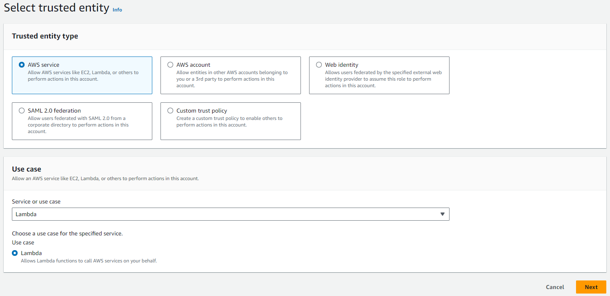
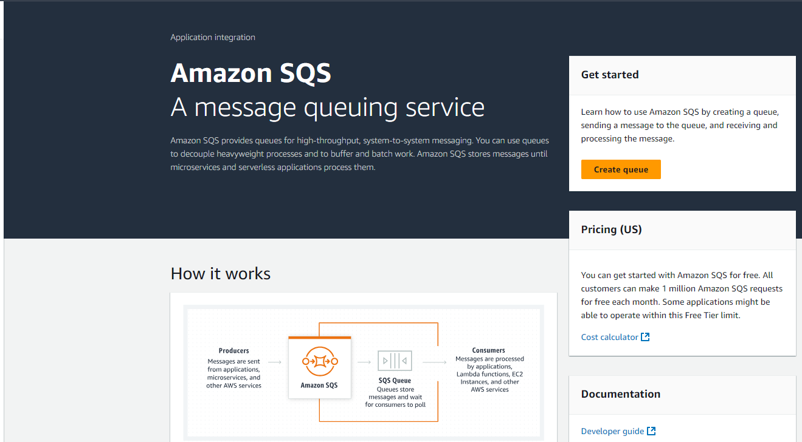
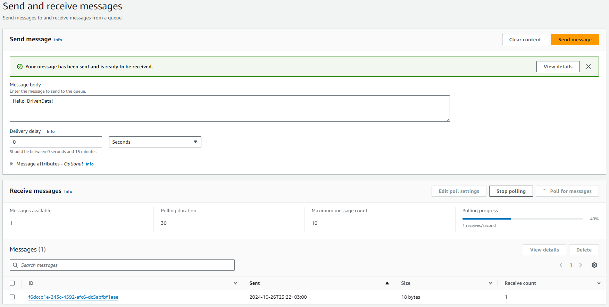
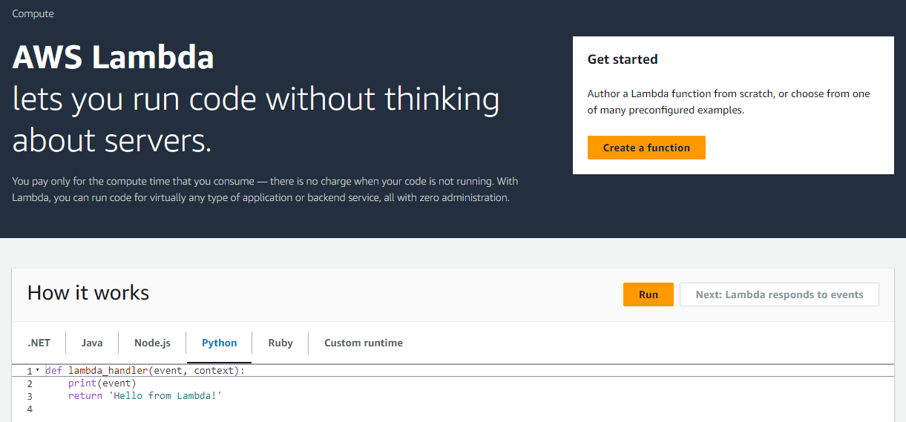
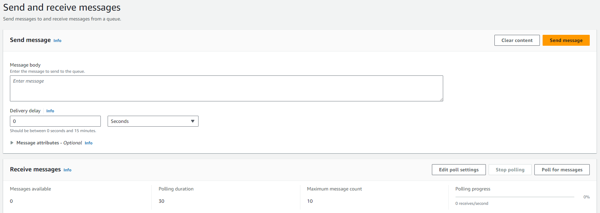
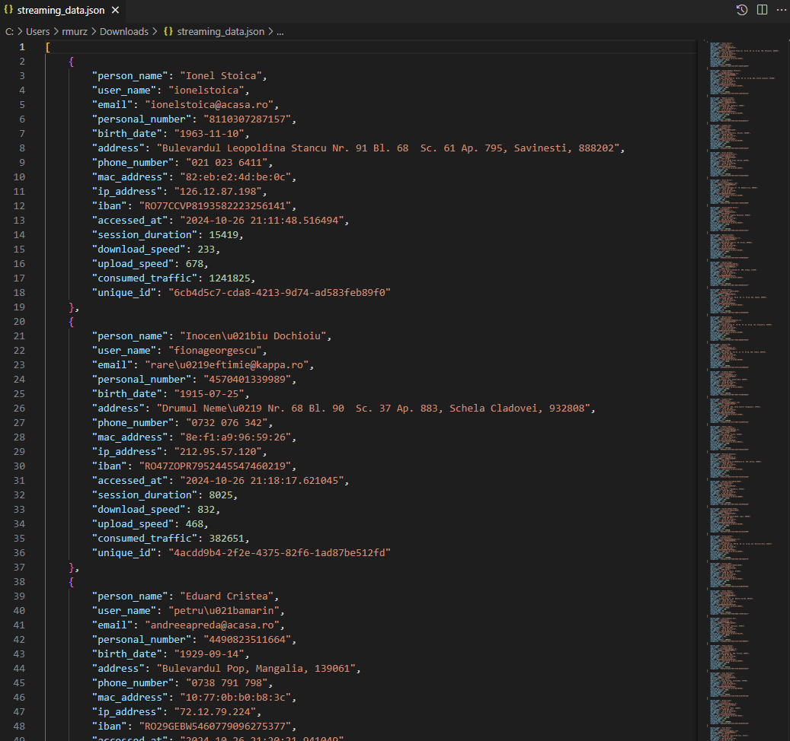

# **Chapter 8:** Streaming processing - *Cloud Pipeline*

**NOTE:** This chapter involve work with cloud services that are charged by the cloud provider. Consult [AWS Pricing calculator](https://calculator.aws/#/) for forecast of the estimated cost of the services used for current chapter.\
If you proceed with this chapter this is on your own responsability and the author don't have any responsability for the resulted bill.

## Scenario
For eighth Chapter / Sprint, the streaming data should be productionized and ingested in real time to the datalake in S3 bucket.

## Assignment
For current Sprint / Chapter your tasks are:
1. **Read** from [Theory](#theory) section about:\
    a. Lambda Function.\
    b. Simple Queue Service.\
    c. JSON.

2. **Implement** from [Practice](#practice) section for *DataDriven* company:\
    a. Create IAM role.

    b. Setup Simple Queue Service:
    * i. Create Simple Queue Service.
    * ii. Test Simple Queue Service.

    c. Setup producer Lambda function:
    * i. Create producer Lambda function.
    * ii. Test producer Lambda function.
    * iii. Run producer Lambda.

    d. Setup consumer Lambda function:
    * i. Create consumer Lambda function.
    * ii. Test consumer Lambda function.
    * iii. Run consumer Lambda.

    e. Validate pipeline:
    * i. Validate the Simple Queue Service.
    * ii. Validate the S3 data.

3. **Work** for *LeadData* company on Sprint / Chapter tasks:\
Read chapter *Scenario*, implement all stages from *Assignment* from `work_8/scenario_8.md` file and put all your work evidences in `work_8` directory.

## Theory
Main theoretical notions of the chapter with proper resources for self paced learning.

### Lambda Function
#### Description
Lambda runs your code on a high-availability compute infrastructure and performs all of the administration of the compute resources, including server and operating system maintenance, capacity provisioning and automatic scaling, and logging. With Lambda, all you need to do is supply your code in one of the language runtimes that Lambda supports. You organize your code into Lambda functions. The Lambda service runs your function only when needed and scales automatically. You only pay for the compute time that you consume—there is no charge when your code is not running.
#### References
[AWS - What is AWS Lambda?](https://docs.aws.amazon.com/lambda/latest/dg/welcome.html)\
[AWS - Create your first Lambda function](https://docs.aws.amazon.com/lambda/latest/dg/getting-started.html)\
[Terraform - Deploy serverless applications with AWS Lambda and API Gateway](https://developer.hashicorp.com/terraform/tutorials/aws/lambda-api-gateway)

### Simple Queue Service
#### Description
SQS enables web service applications that help to quickly and reliably queue messages. These messages have one component in their application that generates only when to be consumed by another component. Therefore, the queue is a temporary repository for messages and these messages are awaiting processing. So, Once these messages are processed, the messages also get deleted from the queue. AWS SQS service basically adds messages in a queue and then, Users will pick up these messages from the queue. A queue is a place where you can store your messages until they are extracted from the queue or expired.
#### References
[GeeksForGeeks - Amazon Web Services – Simple Queue Service(SQS): Complete Setup, Pricing, Features](https://www.geeksforgeeks.org/aws-sqs/)\
[AWS - What is Amazon Simple Queue Service](https://docs.aws.amazon.com/AWSSimpleQueueService/latest/SQSDeveloperGuide/welcome.html)\
[W3Schools - AWS Simple Queue Service](https://www.w3schools.com/aws/aws_cloudessentials_awssqs.php)

### JSON
#### Description
JSON (JavaScript Object Notation) is an open standard file format and data interchange format that uses human-readable text to store and transmit data objects consisting of attribute–value pairs and arrays (or other serializable values). It is a commonly used data format with diverse uses in electronic data interchange, including that of web applications with servers. JSON is a language-independent data format. It was derived from JavaScript, but many modern programming languages include code to generate and parse JSON-format data. JSON filenames use the extension .json. Douglas Crockford originally specified the JSON format in the early 2000s. He and Chip Morningstar sent the first JSON message in April 2001.
#### References
[JSON - Introducing JSON](https://www.json.org/json-en.html)\
[MDN - Working with JSON](https://developer.mozilla.org/en-US/docs/Learn/JavaScript/Objects/JSON)\
[W3Schools - What is JSON?](https://www.w3schools.com/whatis/whatis_json.asp)

## Practice
Implemention for the practical part of the chapter.

### Create IAM role

### Setup Simple Queue Service
#### Create Simple Queue Service

#### Test Simple Queue Service

### Setup producer Lambda function

#### Create producer Lambda function

#### Test producer Lambda function

#### Run producer Lambda.

### Setup consumer Lambda function
#### Create consumer Lambda function

#### Test consumer Lambda function

#### Run consumer Lambda.

### Validate pipeline
#### Validate the Simple Queue Service

#### Validate the S3 data

