# **Chapter 9:** Distributed Computing

**NOTE:** This chapter involves working with cloud services that are charged by the cloud provider. Consult the [AWS Pricing Calculator](https://calculator.aws/#/) for a forecast of the estimated cost of the services used in this chapter. If you proceed with this chapter, you do so at your own responsibility, and the author has no responsibility for the resulting bill.

## Scenario
For the ninth chapter/sprint, as *DrivenData* expects a significant increase in daily data volume and an increasing number of requests from other departments for various analytics, it is required to process the data from the previous two days stored in the data lake in the S3 bucket on a daily basis. The processing should involve filtering and aggregating the data, as well as adding additional columns based on existing ones. After the transformations, the data should be written back to the data lake. The following actions need to be performed: Check for missing values in emails and phone numbers. Ensure correct data types for birth dates and session durations. Delete duplicate records. Retain only the records from 2024 with a session duration longer than 30 minutes. Add a column for total consumed bandwidth. Add a column indicating the activity level of the user. Add a column with masked emails. Provide data for both filtered and grouped datasets.

## Assignment
For this Sprint / Chapter your tasks include:
1. **Read** the following topics in the [Theory](#theory) section:\
    a. Distributed Computing.\
    b. PySpark.\
    c. Resilient Distributed Dataset.\
    d. DataFrame.

2. **Implement** the steps in the [Practice](#practice) section for *DataDriven* company:\
    a. Develop local pipeline:
    * i. Intro Google Colab Notebook.
    * ii. Initialize PySpark Session.
    * iii. Data Processing.
    * iv. Data Analysis.
    * v. Validate transformed data.

    b. Develop cloud pipeline:
    * i. Check raw data.
    * ii. Create IAM role.
    * iii. Create Glue job.
    * iv. Run Glue job.
    * v. Validate transformed data.

3. **Complete** tasks for *LeadData*:
    * Review the *Scenario* section, complete the stages in the *Assignment*, and document your work in `work_9/scenario_9.md`. Store all evidence of your work in the `work_9` directory.

## Theory
The main theoretical notions for the chapter along with resources for self-paced learning.

### Distributed Computing
#### Description
Distributed computing refers to a system where processing and data storage is distributed across multiple devices or systems, rather than being handled by a single central device. In a distributed system, each device or system has its own processing capabilities and may also store and manage its own data. These devices or systems work together to perform tasks and share resources, with no single device serving as the central hub. One example of a distributed computing system is a cloud computing system, where resources such as computing power, storage, and networking are delivered over the Internet and accessed on demand. In this type of system, users can access and use shared resources through a web browser or other client software.
#### References
[AWS - What Is Distributed Computing?](https://aws.amazon.com/what-is/distributed-computing/)\
[IBM - What is distributed computing?](https://www.ibm.com/think/topics/distributed-computing)\
[GeeksForGeeks - What is Distributed Computing?](https://www.geeksforgeeks.org/what-is-distributed-computing/)

### PySpark
#### Description
PySpark is the Python API for Apache Spark. It enables you to perform real-time, large-scale data processing in a distributed environment using Python. It also provides a PySpark shell for interactively analyzing your data. PySpark combines Python’s learnability and ease of use with the power of Apache Spark to enable processing and analysis of data at any size for everyone familiar with Python. PySpark supports all of Spark’s features such as Spark SQL, DataFrames, Structured Streaming, Machine Learning (MLlib) and Spark Core.
#### References
[Apache Spark - PySpark Overview](https://spark.apache.org/docs/latest/api/python/index.html)\
[TutorialsPoint - PySpark Tutorial](https://www.tutorialspoint.com/pyspark/index.htm)\
[GeeksForGeeks - Introduction to PySpark | Distributed Computing with Apache Spark](https://www.geeksforgeeks.org/introduction-pyspark-distributed-computing-apache-spark/)

### Resilient Distributed Dataset
#### Description
In Apache Spark, RDD (Resilient Distributed Datasets) is a fundamental data structure that represents a collection of elements, partitioned across the nodes of a cluster. RDDs can be created from various data sources, including Hadoop Distributed File System (HDFS), local file system, and data stored in a relational database.
#### References
[Apache Spark - RDD Programming Guide](https://spark.apache.org/docs/latest/rdd-programming-guide.html)\
[Databricks - Resilient Distributed Dataset (RDD)](https://www.databricks.com/glossary/what-is-rdd)\
[Spark by Examples - Spark RDD vs DataFrame vs Dataset](https://sparkbyexamples.com/spark/spark-rdd-vs-dataframe-vs-dataset/)

### DataFrame
#### Description
A DataFrame is a two-dimensional labeled data structure with columns of potentially different types. You can think of a DataFrame like a spreadsheet, a SQL table, or a dictionary of series objects. Apache Spark DataFrames provide a rich set of functions (select columns, filter, join, aggregate) that allow you to solve common data analysis problems efficiently. Apache Spark DataFrames are an abstraction built on top of Resilient Distributed Datasets (RDDs). Spark DataFrames and Spark SQL use a unified planning and optimization engine, allowing you to get nearly identical performance across all supported languages on Databricks (Python, SQL, Scala, and R).
#### References
[Databricks - Tutorial: Load and transform data using Apache Spark DataFrames](https://docs.databricks.com/en/getting-started/dataframes.html)\
[Apache Spark - Quickstart: DataFrame](https://spark.apache.org/docs/latest/api/python/getting_started/quickstart_df.html)\
[PhoenixNap - What Is a Spark DataFrame?](https://phoenixnap.com/kb/spark-dataframe)

## Practice
Implemention for the practical part of the chapter.

### Develop local pipeline
Based on the requirements it will be developed local pipeline using [Google Colab Notebook](https://colab.research.google.com/notebook).\
In this Notebook it will be handled missing values for *email* and *phone* columns; provided correct datatypes for *birth_date* and *session_duration* columns; deleted duplicated records based on *unique_id*; filtered only the records that are *accessed_at* in 2024 and have a *session_duration* longer than 30 minutes and returned as a separate file; added column for *total_bandwith*; add a column for *activity_level* of the user; add a column with *masked_email*; returned file for grouped data.

#### Intro Google Colab Notebook
Access [Google Colab Notebook](https://colab.research.google.com/notebook) and create a new Notebook.\
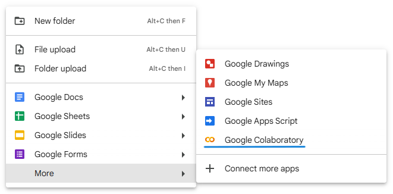

Name the Notebook as `DrivenDataPySparkColab`. Navigate to `Files` section and choose `Upload to session storage` option. Upload files from two consecutive days.\
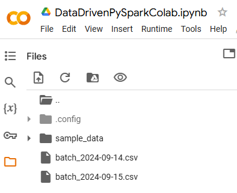

#### Initialize PySpark Session
Insert three `Code` blocks in the Notebook and paste the code blocks from below.
```
!pip install pyspark
!pip install -U -q PyDrive
!apt install openjdk-8-jdk-headless -qq
```
```
import os
os.environ["JAVA_HOME"] = "/usr/lib/jvm/java-8-openjdk-amd64"
```
```
from pyspark.context import SparkContext
from pyspark.sql import SparkSession
from pyspark.sql.functions import col, expr, to_date, when, regexp_replace
from pyspark.sql.types import IntegerType, DateType
```
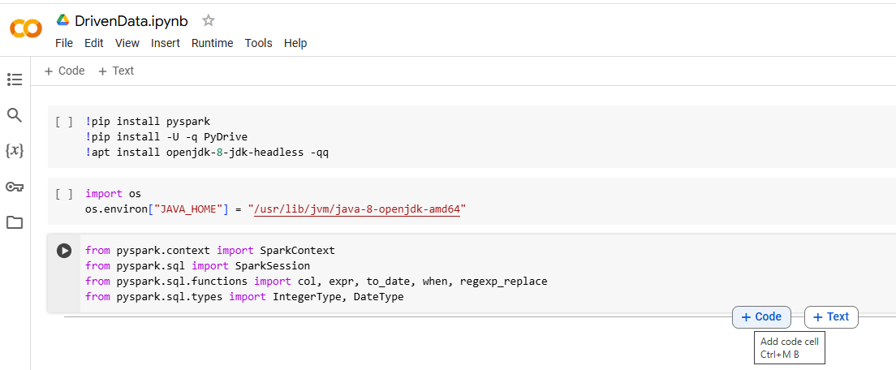

From `Runtime` section choose `Run all` option and all code blocks will be run. It will display the output of the codeblock if any.\ 


#### Data Processing
Create a PySpark Session by using the code from first block. Import data from both files and create dataframes for both of them. Join both dataframe in one dataframe that will be used for further processing.
```
sc = SparkContext.getOrCreate()
spark = SparkSession.builder.appName(
	'DrivenData Distributed Computing').getOrCreate()
```
```
df_14 = spark.read.csv('batch_2024-09-14.csv', header=True, inferSchema=True)
df_15 = spark.read.csv('batch_2024-09-15.csv', header=True, inferSchema=True)
```
```
df = df_14.union(df_15)
```

Run the code block from below to see the schema of the dataframe and to see a sample of records, and also the statistic of the dataframe.
```
df.printSchema()
df.show(5)
df.describe().show()
```
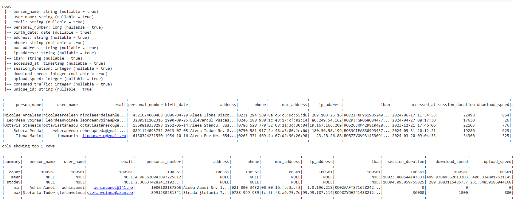

Use code first code block from below to handle missing values for *email* and *phone* columns. Use second code block for delete duplicates. Use the third code block to provide correct datatypes for *birth_data* and *session_duration* columns. Use forth block to filter data by *accessed_at* and *consumed_traffic* columns. Use fifth code block to group data *person_name* by *session_duration* and *consumed_traffic*.
```
df = df.na.fill({"email": "unknown@example.com", "phone": "000-000-0000"})
```
```
df = df.dropDuplicates(subset=["unique_id"])
```
```
df = df.withColumn("birth_date", col("birth_date").cast(DateType()))
df = df.withColumn(
    "session_duration", col("session_duration").cast(IntegerType()))
```
```
df_filtered = df.filter(to_date(df.accessed_at) > '2024-10-13')
df_filtered = df.filter(df.consumed_traffic > 1000)
```
```
df_grouped = df.groupBy("person_name").agg(
    {"session_duration": "avg", "consumed_traffic": "sum"})
df_grouped.show()
```
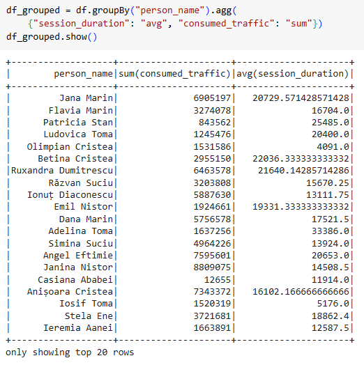

Add a new column *total_bandwith* by sum up *download_speed* and *upload_speed* columns using first code block. Add a new column *activity_level* using second code block. Add a new column *masked_email* using third code block.
```
df = df.withColumn(
    "total_bandwidth", col("download_speed") + col("upload_speed"))
df = df.withColumn("birth_year", expr("year(birth_date)"))
```
```
df = df.withColumn("activity_level",
                   when(col("session_duration") > 120, "active")
                   .when(col("session_duration").between(30, 120), "moderate")
                   .otherwise("less_active"))
```
```
df = df.withColumn("masked_email",
                   regexp_replace("email", "(\\w{3})\\w+@(\\w+)", "$1***@$2"))
```

#### Data Analysis
Get the average and the longer *session_duration* using the code block from below.
```
df.agg({"session_duration": "avg"}).show()
df.agg({"session_duration": "max"}).show()
```


Get the total of the *consumed_traffic* by user *ip_address* and order the results in descendent order.
```
df_ip_activity = df.groupBy("ip_address").agg(
    {"consumed_traffic": "sum"}).orderBy(
        "sum(consumed_traffic)", ascending=False)
df_ip_activity.show()
```


Get the number of session for each day by using the code block from below.
```
df_time = df.withColumn("access_date", to_date("accessed_at")).groupBy("access_date").count()
df_time.show()
```


#### Validate transformed data
Export the results to the destination files using the code from below.
```
df.write.csv("processed_data_2024-10-15.csv", header=True)
```

Check in the Notebook the processed data accessing `Files` section and `processed_data` directory. Open the file and see the actual data stored in there.\


The Google Colab Notebook has the structure available and can run specific section or navigate to it. To access the structure access `Table of contents` section.\


### Develop cloud pipeline
In order to run the pipeline in cloud it will be created a Glue job that will run the PySpark code. The PySpark code will read the data from S3 bucket and will write to S3 bucket transformed data. To be able to do all these operations there will be needed to be created an IAM role with permissions to read and write to S3 and to run a Glue job.

#### Check raw data
Navigate to *S3* service in AWS. Create a S3 bucket named `driven-data-bucket` and a directory named `raw_data`. Inside the directory upload raw data for initial load and from one more day.\


#### Create IAM role
Navigate to *IAM* servive in AWS and choose *Role* section. Create a new role by choosing `AWS service` for the *Trusted entity type*. Select `Glue` option for the *Use case*.\
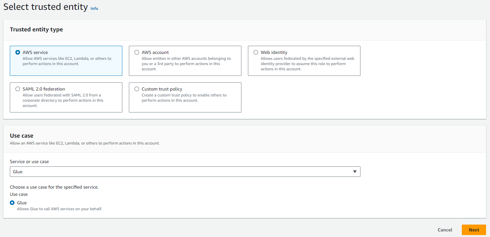

Choose `AWSGlueConsoleFullAccess` and `AmazonS3FullAccess` policies. The policies should allow access only to run a specific Glue job and to read and write to a specific bucket, for this the policies can be updated accordingly.\
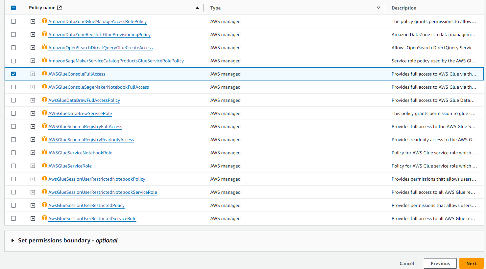

Enter `glue_job_role` for the *Role name* option. Provide a description for the role. Also, check the *Selected trusted entities* and *Add permissions* options.\


#### Create Glue job
Navigate to *Glue* service in AWS. Select create a new job. In `Job details` menu enter `drivendata_transform` as a name for the Glue job. Provide a description for the job. Select created IAM role for *IAM Role* option. Select rest of the options as per image below.\
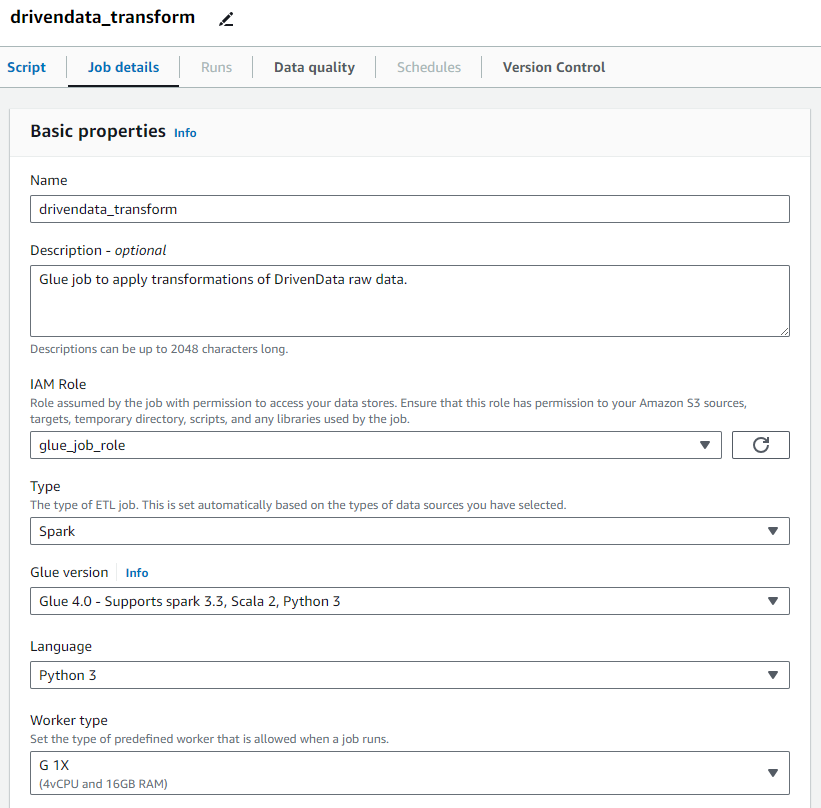

In `Script` menu will be provided default PySpark code that should be extended with desired functionality. Copy the code from below and replace the default code.\
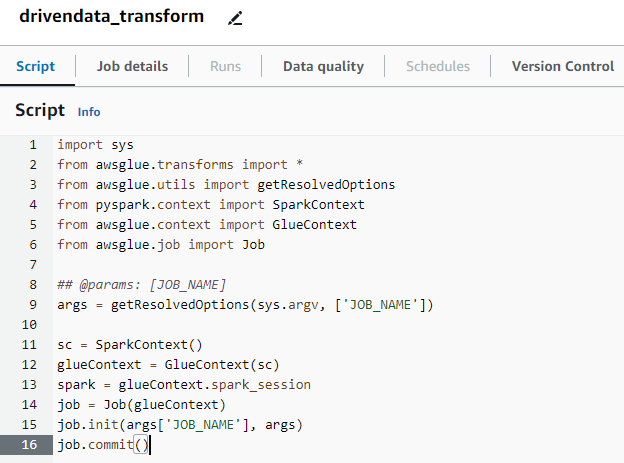
```
import sys
from awsglue.transforms import *
from awsglue.utils import getResolvedOptions
from pyspark.context import SparkContext
from awsglue.context import GlueContext
from awsglue.job import Job
from awsglue.dynamicframe import DynamicFrame
from pyspark.sql.functions import col, to_date, when, regexp_replace, expr
from pyspark.sql.types import IntegerType, DateType

args = getResolvedOptions(sys.argv, ['JOB_NAME'])

sc = SparkContext()
glueContext = GlueContext(sc)
spark = glueContext.spark_session
job = Job(glueContext)
job.init(args['JOB_NAME'], args)

input_path = "s3://driven-data-bucket/raw_data/"
dynamic_frame = glueContext.create_dynamic_frame.from_options(
    connection_type="s3",
    connection_options={"paths": [input_path]},
    format="csv",
    format_options={"withHeader": True}
)

df = dynamic_frame.toDF()

df = df.na.fill({"email": "unknown@example.com", "phone": "000-000-0000"})
df = df.withColumn("birth_date", col("birth_date").cast(DateType()))
df = df.withColumn("session_duration", col("session_duration").cast(IntegerType()))
df = df.dropDuplicates(subset=["unique_id"])

df_filtered = df.filter((df["session_duration"] > 30) & (to_date(df["accessed_at"]) > "2024-01-01"))
df_filtered = df_filtered.withColumn("total_bandwidth", col("download_speed") + col("upload_speed"))
df_filtered = df_filtered.withColumn("activity_level", when(col("session_duration") > 120, "active")
                                              .when(col("session_duration").between(30, 120), "moderate")
                                              .otherwise("less_active"))
df_filtered = df_filtered.withColumn("masked_email", regexp_replace("email", "(\\w{3})\\w+@(\\w+)", "$1***@$2"))

df_grouped = df_filtered.groupBy("person_name").agg({"session_duration": "avg", "consumed_traffic": "sum"})

filtered_dynamic_frame = DynamicFrame.fromDF(df_filtered, glueContext, "filtered_dynamic_frame")
grouped_dynamic_frame = DynamicFrame.fromDF(df_grouped, glueContext, "grouped_dynamic_frame")

output_path = "s3://driven-data-bucket/transformed_data/"

glueContext.write_dynamic_frame.from_options(
    frame=filtered_dynamic_frame,
    connection_type="s3",
    connection_options={"path": output_path + "filtered/"},
    format="csv",
    format_options={"header": True}
)

glueContext.write_dynamic_frame.from_options(
    frame=grouped_dynamic_frame,
    connection_type="s3",
    connection_options={"path": output_path + "grouped/"},
    format="csv",
    format_options={"header": True}
)

job.commit()
```

#### Schedule pipeline run
For the current GLue job access the `Schedule job run` section. Enter `Daily_drivenData_Transform` as a *Name*. Select `Daily` for *Frequency* option. Eneter `8` as *Start hour* and `0` as *Minute of the hour*. Provide a description for the scheduler.\
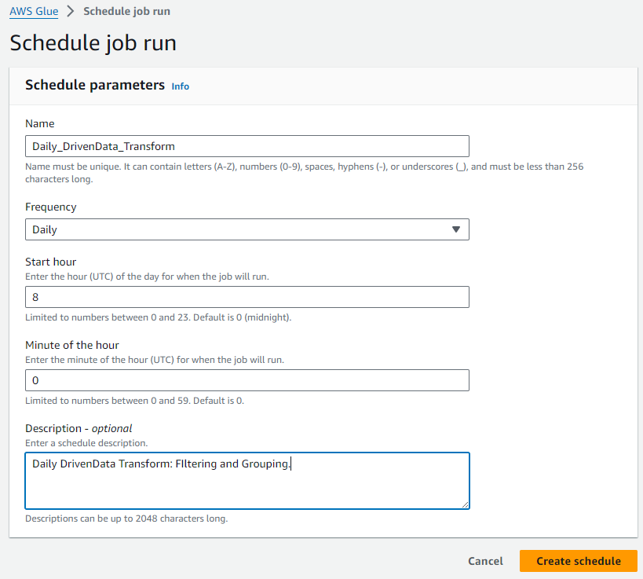

#### Run Glue job
As the Glue job is ready to be run, now it will run on daily basis at 08:00 AM. In this section will be displayed all runs of the job with all related informations and logs related to the specific run.\


 Also, the job can be triggered manually by pressing `Run`. After the job was run the output logs can be monitored in *CloudWatch*. Also, it will display the status of each run.\


#### Validate transformed data
Navigate to *S3* service in AWS and select *driven-data-bucket*. Inside the bucket will be created a new directory named `transformed_data`. Inside of the new directory will be two subdirectories `filtered` and `grouped` where all output files will be stored.\


Access the file inside each subdirectories and download the to validate the data or query them directly in the datalake. Or make them available in the Athena database and make more complex query there for data validation.\
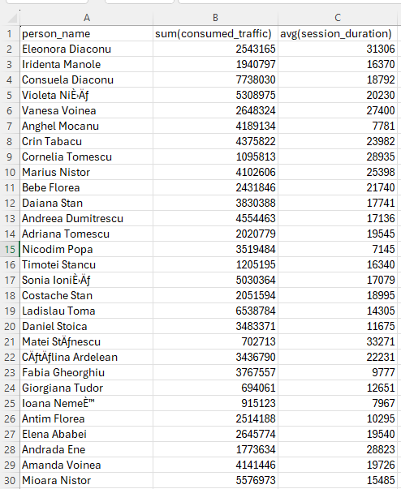