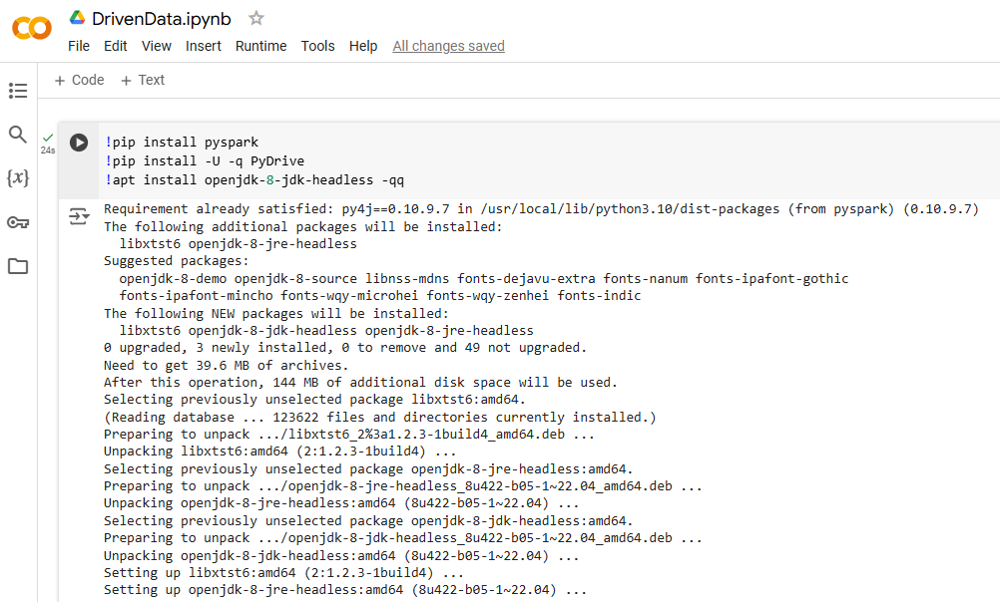
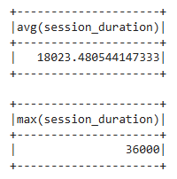
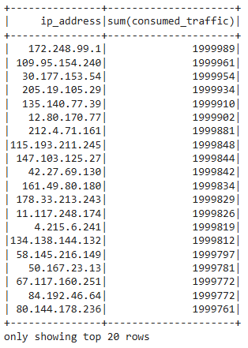
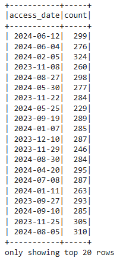
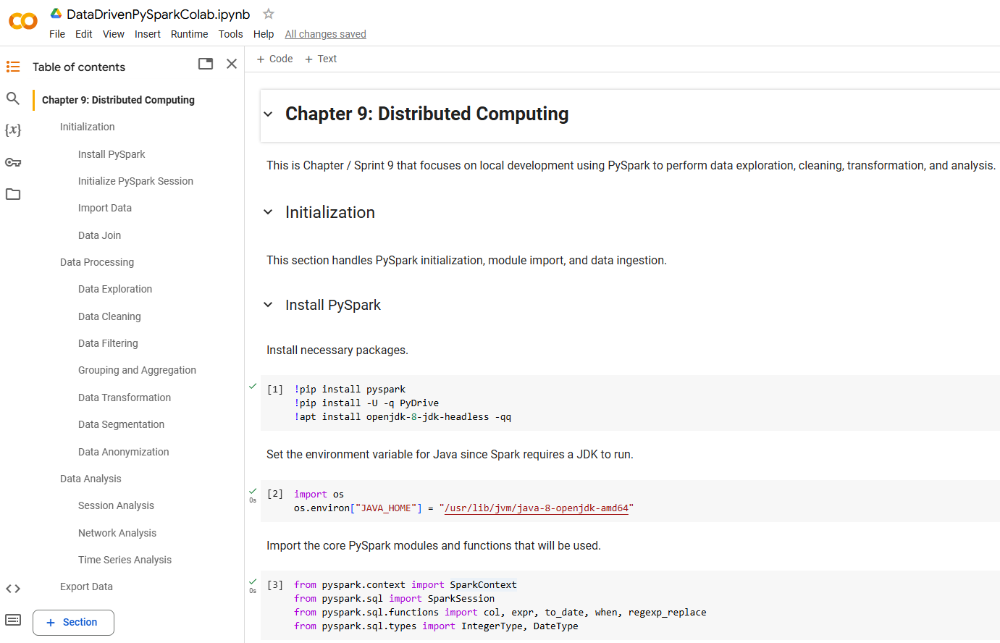
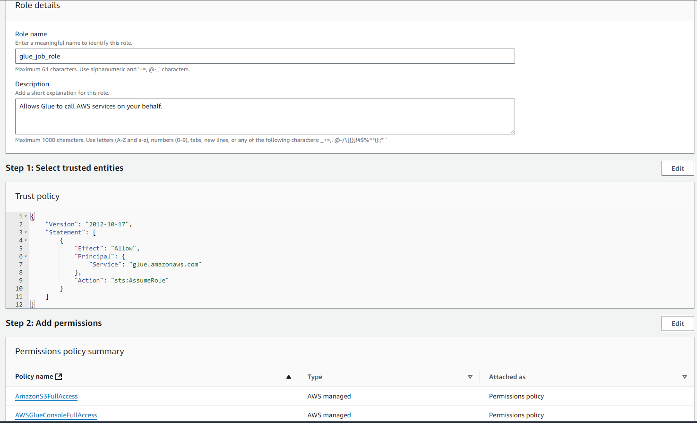

# **Chapter 9:** Distributed Computing

## Scenario
For ninth Chapter / Sprint, as the *DrivenData* company exptect a big amount of data daily and also increasing requests from other departments for different analytics, it is required to process on daily basis data from previous two days from datalake that is stored in S3 bucket and process data by filtering and aggregating and also add aditional columns based on existing ones. After transformations it is required to write data back to the datalake. Check if there are missing values for emails and phone numbers; provide correct datatypes for birth dates and sessions duration; delete duplicated records; provide only the records that are from 2024 and have a session duration was longer than 30 minutes; add column for total consumed bandwith; add a column for activity level of the user; add a column with masked emails; provide data for filtered data for and for grouped data.

## Assignment
For current Sprint / Chapter your tasks are:
1. **Read** from [Theory](#theory) section about:\
    a. Distributed Computing.\
    b. PySpark.\
    c. Resilient Distributed Dataset.\
    d. DataFrame.

2. **Implement** from [Practice](#practice) section for *DataDriven* company:\
    a. Develop local pipeline:
    * i. Intro Google Colab Notebook.
    * ii. Initialize PySpark Session.
    * iii. Data Processing.
    * iv. Data Analysis.
    * v. Validate transformed data.

    b. Develop cloud pipeline:
    * i. Check raw data.
    * ii. Create IAM role.
    * iii. Create Glue job.
    * iv. Run Glue job.
    * v. Validate transformed data.

3. **Work** for *LeadData* company on Sprint / Chapter tasks:\
Read chapter *Scenario*, implement all stages from *Assignment* from `work_9/scenario_9.md` file and put all your work evidences in `work_9` directory.

## Theory
Main theoretical notions of the chapter with proper resources for self paced learning.

### Distributed Computing
#### Description
Distributed computing refers to a system where processing and data storage is distributed across multiple devices or systems, rather than being handled by a single central device. In a distributed system, each device or system has its own processing capabilities and may also store and manage its own data. These devices or systems work together to perform tasks and share resources, with no single device serving as the central hub. One example of a distributed computing system is a cloud computing system, where resources such as computing power, storage, and networking are delivered over the Internet and accessed on demand. In this type of system, users can access and use shared resources through a web browser or other client software.
#### References
[AWS - What Is Distributed Computing?](https://aws.amazon.com/what-is/distributed-computing/)\
[IBM - What is distributed computing?](https://www.ibm.com/think/topics/distributed-computing)\
[GeeksForGeeks - What is Distributed Computing?](https://www.geeksforgeeks.org/what-is-distributed-computing/)

### PySpark
#### Description
PySpark is the Python API for Apache Spark. It enables you to perform real-time, large-scale data processing in a distributed environment using Python. It also provides a PySpark shell for interactively analyzing your data. PySpark combines Python’s learnability and ease of use with the power of Apache Spark to enable processing and analysis of data at any size for everyone familiar with Python. PySpark supports all of Spark’s features such as Spark SQL, DataFrames, Structured Streaming, Machine Learning (MLlib) and Spark Core.
#### References
[Apache Spark - PySpark Overview](https://spark.apache.org/docs/latest/api/python/index.html)\
[TutorialsPoint - PySpark Tutorial](https://www.tutorialspoint.com/pyspark/index.htm)\
[GeeksForGeeks - Introduction to PySpark | Distributed Computing with Apache Spark](https://www.geeksforgeeks.org/introduction-pyspark-distributed-computing-apache-spark/)

### Resilient Distributed Dataset
#### Description
In Apache Spark, RDD (Resilient Distributed Datasets) is a fundamental data structure that represents a collection of elements, partitioned across the nodes of a cluster. RDDs can be created from various data sources, including Hadoop Distributed File System (HDFS), local file system, and data stored in a relational database.
#### References
[Apache Spark - RDD Programming Guide](https://spark.apache.org/docs/latest/rdd-programming-guide.html)\
[Databricks - Resilient Distributed Dataset (RDD)](https://www.databricks.com/glossary/what-is-rdd)\
[Spark by Examples - Spark RDD vs DataFrame vs Dataset](https://sparkbyexamples.com/spark/spark-rdd-vs-dataframe-vs-dataset/)

### DataFrame
#### Description
A DataFrame is a two-dimensional labeled data structure with columns of potentially different types. You can think of a DataFrame like a spreadsheet, a SQL table, or a dictionary of series objects. Apache Spark DataFrames provide a rich set of functions (select columns, filter, join, aggregate) that allow you to solve common data analysis problems efficiently. Apache Spark DataFrames are an abstraction built on top of Resilient Distributed Datasets (RDDs). Spark DataFrames and Spark SQL use a unified planning and optimization engine, allowing you to get nearly identical performance across all supported languages on Databricks (Python, SQL, Scala, and R).
#### References
[Databricks - Tutorial: Load and transform data using Apache Spark DataFrames](https://docs.databricks.com/en/getting-started/dataframes.html)\
[Apache Spark - Quickstart: DataFrame](https://spark.apache.org/docs/latest/api/python/getting_started/quickstart_df.html)\
[PhoenixNap - What Is a Spark DataFrame?](https://phoenixnap.com/kb/spark-dataframe)

## Practice
Implemention for the practical part of the chapter.

### Develop local pipeline
Based on the requirements it will be developed local pipeline using [Google Colab Notebook](https://colab.research.google.com/notebook).\
In this Notebook it will be handled missing values for *email* and *phone* columns; provided correct datatypes for *birth_date* and *session_duration* columns; deleted duplicated records based on *unique_id*; filtered only the records that are *accessed_at* in 2024 and have a *session_duration* longer than 30 minutes and returned as a separate file; added column for *total_bandwith*; add a column for *activity_level* of the user; add a column with *masked_email*; returned file for grouped data.

#### Intro Google Colab Notebook
Access [Google Colab Notebook](https://colab.research.google.com/notebook) and create a new Notebook.\


Name the Notebook as `DrivenDataPySparkColab`. Navigate to `Files` section and choose `Upload to session storage` option. Upload files from two consecutive days.\


#### Initialize PySpark Session
Insert three `Code` blocks in the Notebook and paste the code blocks from below.
```
!pip install pyspark
!pip install -U -q PyDrive
!apt install openjdk-8-jdk-headless -qq
```
```
import os
os.environ["JAVA_HOME"] = "/usr/lib/jvm/java-8-openjdk-amd64"
```
```
from pyspark.context import SparkContext
from pyspark.sql import SparkSession
from pyspark.sql.functions import col, expr, to_date, when, regexp_replace
from pyspark.sql.types import IntegerType, DateType
```


From `Runtime` section choose `Run all` option and all code blocks will be run. It will display the output of the codeblock if any.\ 


#### Data Processing
Create a PySpark Session by using the code from first block. Import data from both files and create dataframes for both of them. Join both dataframe in one dataframe that will be used for further processing.
```
sc = SparkContext.getOrCreate()
spark = SparkSession.builder.appName(
	'DrivenData Distributed Computing').getOrCreate()
```
```
df_14 = spark.read.csv('batch_2024-09-14.csv', header=True, inferSchema=True)
df_15 = spark.read.csv('batch_2024-09-15.csv', header=True, inferSchema=True)
```
```
df = df_14.union(df_15)
```

Run the code block from below to see the schema of the dataframe and to see a sample of records, and also the statistic of the dataframe.
```
df.printSchema()
df.show(5)
df.describe().show()
```


Use code first code block from below to handle missing values for *email* and *phone* columns. Use second code block for delete duplicates. Use the third code block to provide correct datatypes for *birth_data* and *session_duration* columns. Use forth block to filter data by *accessed_at* and *consumed_traffic* columns. Use fifth code block to group data *person_name* by *session_duration* and *consumed_traffic*.
```
df = df.na.fill({"email": "unknown@example.com", "phone": "000-000-0000"})
```
```
df = df.dropDuplicates(subset=["unique_id"])
```
```
df = df.withColumn("birth_date", col("birth_date").cast(DateType()))
df = df.withColumn(
    "session_duration", col("session_duration").cast(IntegerType()))
```
```
df_filtered = df.filter(to_date(df.accessed_at) > '2024-10-13')
df_filtered = df.filter(df.consumed_traffic > 1000)
```
```
df_grouped = df.groupBy("person_name").agg(
    {"session_duration": "avg", "consumed_traffic": "sum"})
df_grouped.show()
```


Add a new column *total_bandwith* by sum up *download_speed* and *upload_speed* columns using first code block. Add a new column *activity_level* using second code block. Add a new column *masked_email* using third code block.
```
df = df.withColumn(
    "total_bandwidth", col("download_speed") + col("upload_speed"))
df = df.withColumn("birth_year", expr("year(birth_date)"))
```
```
df = df.withColumn("activity_level",
                   when(col("session_duration") > 120, "active")
                   .when(col("session_duration").between(30, 120), "moderate")
                   .otherwise("less_active"))
```
```
df = df.withColumn("masked_email",
                   regexp_replace("email", "(\\w{3})\\w+@(\\w+)", "$1***@$2"))
```

#### Data Analysis
Get the average and the longer *session_duration* using the code block from below.
```
df.agg({"session_duration": "avg"}).show()
df.agg({"session_duration": "max"}).show()
```


Get the total of the *consumed_traffic* by user *ip_address* and order the results in descendent order.
```
df_ip_activity = df.groupBy("ip_address").agg(
    {"consumed_traffic": "sum"}).orderBy(
        "sum(consumed_traffic)", ascending=False)
df_ip_activity.show()
```


Get the number of session for each day by using the code block from below.
```
df_time = df.withColumn("access_date", to_date("accessed_at")).groupBy("access_date").count()
df_time.show()
```


#### Validate transformed data
Export the results to the destination files using the code from below.
```
df.write.csv("processed_data_2024-10-15.csv", header=True)
```

Check in the Notebook the processed data accessing `Files` section and `processed_data` directory. Open the file and see the actual data stored in there.\


The Google Colab Notebook has the structure available and can run specific section or navigate to it. To access the structure access `Table of contents` section.\


### Develop cloud pipeline

#### Check raw data


#### Create IAM role




#### Create Glue job


#### Schedule pipeline run


#### Run Glue job


#### Validate transformed data


